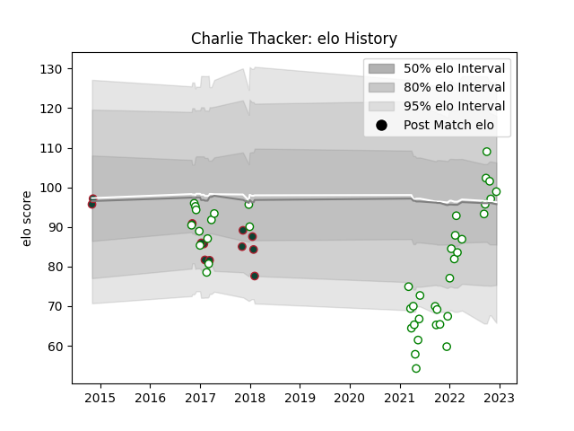

---  
layout: page  
title: Charlie Thacker  
date: 2022-12-14 11:33:48.347146  
categories: player  
---
# Charlie Thacker

## Positions: C

## Current elo: 84.0

## Current Percentile: 18.0

# Elo History

# Match History

| Team             |   Appearances |   Win Rate |
|:-----------------|--------------:|-----------:|
| Leicester Tigers |            12 |   0.583333 |

| Opponent           |   Matches |   Win Rate |
|:-------------------|----------:|-----------:|
| Bath Rugby         |         2 |        0.5 |
| Saracens           |         2 |        0.5 |
| Wasps              |         2 |        0   |
| Cardiff Blues      |         1 |        1   |
| Castres Olympique  |         1 |        0   |
| Gloucester Rugby   |         1 |        1   |
| London Irish       |         1 |        1   |
| Northampton Saints |         1 |        1   |
| Sale Sharks        |         1 |        1   |