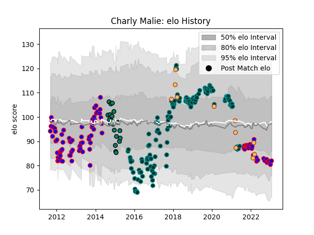

---  
layout: page  
title: Charly Malie  
date: 2022-12-09 13:18:28.073126  
categories: player  
---
# Charly Malie

## Positions: FB, FH

## Country: Spain

## Current elo: 94.0

## Current Percentile: 39.0

# Elo History

# Match History

| Team      |   Appearances |   Win Rate |
|:----------|--------------:|-----------:|
| Pau       |           136 |   0.455882 |
| Beziers   |            64 |   0.375    |
| Montauban |            18 |   0.555556 |
| Spain     |            11 |   0.545455 |

| Opponent             |   Matches |   Win Rate |
|:---------------------|----------:|-----------:|
| Agen                 |        13 |   0.923077 |
| Clermont Auvergne    |        11 |   0.272727 |
| Castres Olympique    |        11 |   0.363636 |
| Racing 92            |        10 |   0.3      |
| Stade Francais Paris |        10 |   0.5      |
| Brive                |         9 |   0.222222 |
| Montpellier Herault  |         9 |   0.444444 |
| Bordeaux Begles      |         9 |   0.444444 |
| Lyon                 |         8 |   0.4375   |
| La Rochelle          |         8 |   0.125    |
| Grenoble             |         8 |   0.75     |
| Stade Toulousain     |         8 |   0.375    |
| Aurillac             |         7 |   0.428571 |
| Toulon               |         7 |   0.285714 |
| Narbonne             |         6 |   0.416667 |
| Mont-de-Marsan       |         6 |   0.416667 |
| Bayonne              |         6 |   0.916667 |
| Carcassonne          |         5 |   0.2      |
| Provence Rugby       |         4 |   0.25     |
| Oyonnax              |         4 |   0.5      |
| Pau                  |         4 |   0        |
| Dax                  |         4 |   0.5      |
| Colomiers            |         4 |   0.25     |
| US Bressane          |         4 |   0.25     |
| Cardiff Blues        |         4 |   0        |
| Tarbes               |         4 |   0.5      |
| Albi                 |         3 |   0.666667 |
| Massy                |         3 |   0.666667 |
| Bourgoin-Jallieu     |         3 |   0.666667 |
| Perpignan            |         3 |   1        |
| Romania              |         3 |   0.666667 |
| Auch                 |         2 |   0.5      |
| Sale Sharks          |         2 |   0        |
| Portugal             |         2 |   0.5      |
| Bristol Rugby        |         2 |   0        |
| Nevers               |         2 |   0.5      |
| Beziers              |         2 |   0.5      |
| Georgia              |         2 |   0        |
| Russia               |         2 |   1        |
| Worcester Warriors   |         2 |   1        |
| Soyaux-Angouleme     |         1 |   0        |
| Vannes               |         1 |   0        |
| Leicester Tigers     |         1 |   1        |
| Périgueux            |         1 |   0        |
| Ospreys              |         1 |   1        |
| Gloucester Rugby     |         1 |   1        |
| Dragons              |         1 |   0        |
| Calvisano            |         1 |   1        |
| Brazil               |         1 |   1        |
| Biarritz Olympique   |         1 |   1        |
| Belgium              |         1 |   0        |
| Bath Rugby           |         1 |   0        |
| Zebre                |         1 |   1        |