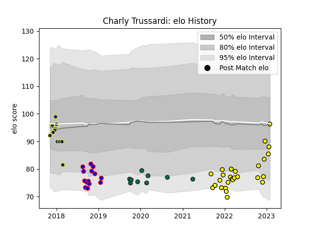

---  
layout: page  
title: Charly Trussardi  
date: 2023-01-17 11:45:49.159213  
categories: player  
---
# Charly Trussardi

## Positions: SH, W

## Current elo: 85.0

## Current Percentile: 33.0

# Elo History

# Match History

| Team              |   Appearances |   Win Rate |
|:------------------|--------------:|-----------:|
| Albi              |            25 |   0.76     |
| Beziers           |            14 |   0.571429 |
| Clermont Auvergne |            13 |   0.346154 |
| Benetton Treviso  |             9 |   0.111111 |

| Opponent                   |   Matches |   Win Rate |
|:---------------------------|----------:|-----------:|
| Oyonnax                    |         4 |   0.375    |
| Lyon                       |         3 |   0.333333 |
| Bourgoin-Jallieu           |         3 |   1        |
| Cognac Saint Jean d'Angély |         2 |   1        |
| Montpellier Herault        |         2 |   0        |
| Massy                      |         2 |   0.5      |
| Aubenas                    |         2 |   1        |
| Dijon                      |         2 |   1        |
| Dax                        |         2 |   0.5      |
| Saracens                   |         2 |   1        |
| Northampton Saints         |         2 |   0        |
| Soyaux-Angouleme           |         2 |   0.5      |
| Chambery                   |         2 |   1        |
| Suresnes                   |         2 |   0.5      |
| US Bressane                |         2 |   1        |
| Brive                      |         2 |   0.5      |
| Blagnac                    |         2 |   1        |
| Nice                       |         2 |   0        |
| Tarbes                     |         1 |   1        |
| Rennes                     |         1 |   1        |
| Racing 92                  |         1 |   0        |
| Pau                        |         1 |   0        |
| Valence Romans Drome Rugby |         1 |   1        |
| Ospreys                    |         1 |   0        |
| Vannes                     |         1 |   0        |
| Agen                       |         1 |   1        |
| Montauban                  |         1 |   1        |
| Mont-de-Marsan             |         1 |   0        |
| Leinster                   |         1 |   0        |
| Glasgow Warriors           |         1 |   0        |
| Dragons                    |         1 |   1        |
| Connacht                   |         1 |   0        |
| Colomiers                  |         1 |   0        |
| Castres Olympique          |         1 |   0        |
| Cardiff Blues              |         1 |   0        |
| Carcassonne                |         1 |   0        |
| Bayonne                    |         1 |   1        |
| Aurillac                   |         1 |   1        |
| Zebre                      |         1 |   0        |