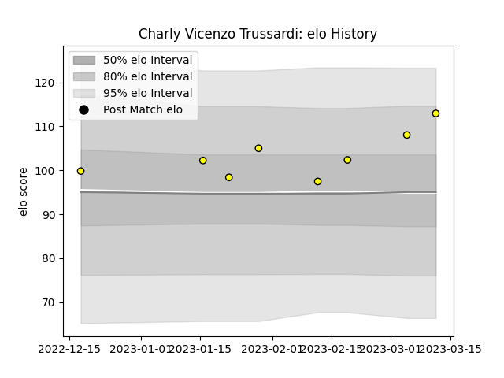

---  
layout: page  
title: Charly Vicenzo Trussardi  
date: 2023-02-24 02:28:20.040749  
categories: player  
---
# Charly Vicenzo Trussardi

## Positions: W

## Current elo: 110.0

## Current Percentile: 76.0

# Elo History

# Match History

| Team   |   Appearances |   Win Rate |
|:-------|--------------:|-----------:|
| Albi   |             9 |   0.833333 |

| Opponent                   |   Matches |   Win Rate |
|:---------------------------|----------:|-----------:|
| Blagnac                    |         1 |        1   |
| Bourgoin-Jallieu           |         1 |        0   |
| Carqueiranne-Hyères        |         1 |        1   |
| Chambery                   |         1 |        1   |
| Cognac Saint Jean d'Angély |         1 |        1   |
| Narbonne                   |         1 |        1   |
| Nice                       |         1 |        0.5 |
| Rennes                     |         1 |        1   |
| US Bressane                |         1 |        1   |