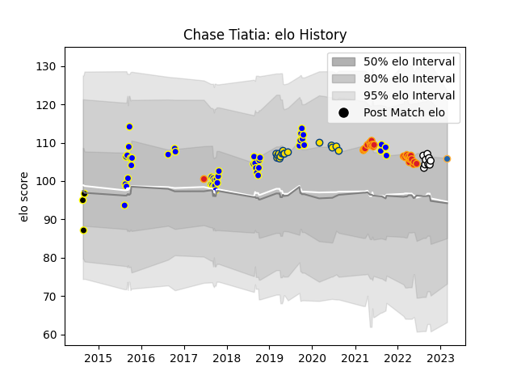

---  
layout: page  
title: Chase Tiatia  
date: 2023-03-17 17:22:49.777522  
categories: player  
---
# Chase Tiatia

## Positions: FB, W

## Country: Chiefs

## Current elo: 103.0

## Current Percentile: 73.0

# Elo History

# Match History

| Team          |   Appearances |   Win Rate |
|:--------------|--------------:|-----------:|
| Bay of Plenty |            46 |   0.51087  |
| Chiefs        |            24 |   0.708333 |
| Hurricanes    |            16 |   0.71875  |
| Hawke's Bay   |             9 |   0.611111 |
| Wellington    |             3 |   0        |
| Western Force |             3 |   0.666667 |

| Opponent                 |   Matches |   Win Rate |
|:-------------------------|----------:|-----------:|
| Hawke's Bay              |         8 |   0.5      |
| Crusaders                |         7 |   0.285714 |
| Southland                |         6 |   1        |
| Taranaki                 |         6 |   0.333333 |
| Manawatu                 |         6 |   0.666667 |
| Blues                    |         5 |   0.4      |
| Wellington               |         5 |   0        |
| Otago                    |         5 |   0.4      |
| Moana Pasifika           |         5 |   1        |
| Northland                |         5 |   0.6      |
| Melbourne Rebels         |         4 |   1        |
| Highlanders              |         4 |   0.75     |
| Counties Manukau         |         4 |   0.875    |
| Queensland Reds          |         3 |   0.333333 |
| Tasman                   |         3 |   0.333333 |
| Waikato                  |         3 |   0.5      |
| North Harbour            |         3 |   0.666667 |
| Sunwolves                |         2 |   1        |
| Auckland                 |         2 |   0        |
| New South Wales Waratahs |         2 |   1        |
| Hurricanes               |         2 |   1        |
| Chiefs                   |         2 |   0.75     |
| Brumbies                 |         2 |   1        |
| Western Force            |         2 |   1        |
| Bay of Plenty            |         1 |   0        |
| Lions                    |         1 |   1        |
| Stormers                 |         1 |   1        |
| Canterbury               |         1 |   0        |
| British and Irish Lions  |         1 |   0        |