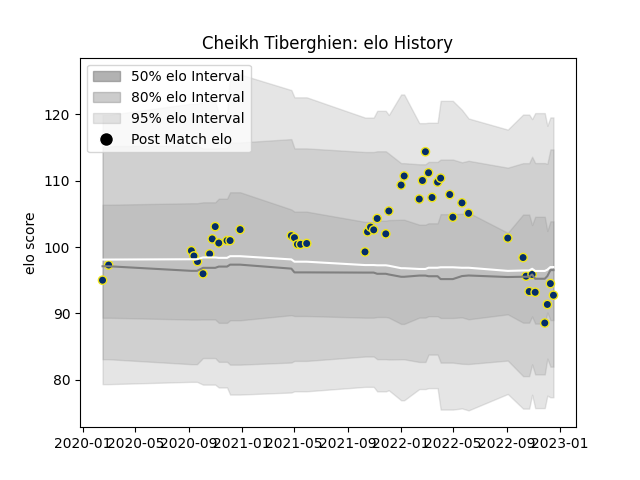

---  
layout: page  
title: Cheikh Tiberghien  
date: 2023-01-06 00:25:41.091555  
categories: player  
---
# Cheikh Tiberghien

## Positions: FB, W

## Current elo: 96.0

## Current Percentile: 34.0

# Elo History

# Match History

| Team              |   Appearances |   Win Rate |
|:------------------|--------------:|-----------:|
| Clermont Auvergne |            50 |       0.51 |

| Opponent             |   Matches |   Win Rate |
|:---------------------|----------:|-----------:|
| Stade Toulousain     |         5 |   0.4      |
| Brive                |         5 |   0.6      |
| Toulon               |         4 |   0.5      |
| Stade Francais Paris |         4 |   0.5      |
| Racing 92            |         4 |   0        |
| Montpellier Herault  |         4 |   0.75     |
| Pau                  |         3 |   1        |
| Bordeaux Begles      |         3 |   0.5      |
| Castres Olympique    |         3 |   0.333333 |
| Perpignan            |         3 |   0.666667 |
| Agen                 |         2 |   1        |
| Bayonne              |         2 |   0        |
| La Rochelle          |         2 |   0        |
| Biarritz Olympique   |         2 |   1        |
| Lyon                 |         2 |   0.5      |
| Leicester Tigers     |         1 |   0        |
| Stormers             |         1 |   1        |