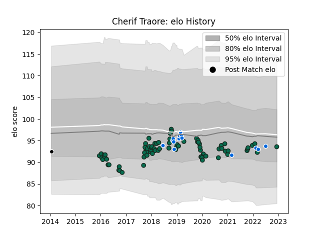

---  
layout: page  
title: Cherif Traore  
date: 2023-01-06 00:26:24.674840  
categories: player  
---
# Cherif Traore

## Positions: P

## Country: Italy

## Current elo: 103.0

## Current Percentile: 40.0

# Elo History

# Match History

| Team             |   Appearances |   Win Rate |
|:-----------------|--------------:|-----------:|
| Benetton Treviso |            82 |   0.341463 |
| Italy            |            17 |   0.411765 |
| Cavalieri Prato  |             1 |   0        |

| Opponent             |   Matches |   Win Rate |
|:---------------------|----------:|-----------:|
| Zebre                |        13 |  0.692308  |
| Scarlets             |         8 |  0.125     |
| Ospreys              |         7 |  0.142857  |
| Dragons              |         6 |  0.75      |
| Ulster               |         6 |  0.0833333 |
| Leinster             |         6 |  0.166667  |
| Cardiff Blues        |         6 |  0.166667  |
| Edinburgh            |         5 |  0.4       |
| Connacht             |         3 |  0.333333  |
| Stade Francais Paris |         3 |  0.333333  |
| Glasgow Warriors     |         3 |  0.333333  |
| Ireland              |         3 |  0         |
| Lyon                 |         2 |  0.5       |
| Wales                |         2 |  0.5       |
| Toulon               |         2 |  0         |
| Southern Kings       |         2 |  1         |
| Northampton Saints   |         2 |  0         |
| Munster              |         2 |  0         |
| England              |         2 |  0         |
| Georgia              |         2 |  1         |
| London Irish         |         1 |  0         |
| Scotland             |         1 |  0         |
| Uruguay              |         1 |  1         |
| Bath Rugby           |         1 |  0         |
| France               |         1 |  0         |
| Grenoble             |         1 |  1         |
| Harlequins           |         1 |  0         |
| Australia            |         1 |  0         |
| Romania              |         1 |  1         |
| Portugal             |         1 |  1         |
| Cheetahs             |         1 |  1         |
| Japan                |         1 |  1         |
| New Zealand          |         1 |  0         |
| Leicester Tigers     |         1 |  0         |
| Agen                 |         1 |  0         |