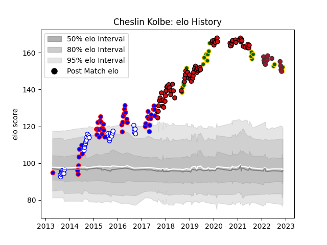

---  
layout: page  
title: Cheslin Kolbe  
date: 2023-02-02 18:49:54.456824  
categories: player  
---
# Cheslin Kolbe

## Positions: W, FB

## Country: South Africa

## Current elo: 149.0

## Current Percentile: 99.0

# Elo History

# Match History

| Team             |   Appearances |   Win Rate |
|:-----------------|--------------:|-----------:|
| Stade Toulousain |            77 |   0.766234 |
| Stormers         |            49 |   0.632653 |
| Western Province |            36 |   0.777778 |
| South Africa     |            24 |   0.6875   |
| Toulon           |            19 |   0.578947 |

| Opponent                 |   Matches |   Win Rate |
|:-------------------------|----------:|-----------:|
| Bordeaux Begles          |         9 |   0.888889 |
| La Rochelle              |         8 |   0.75     |
| Golden Lions             |         8 |   0.4375   |
| Racing 92                |         8 |   0.625    |
| Blue Bulls               |         8 |   0.8125   |
| Bulls                    |         7 |   0.714286 |
| Montpellier Herault      |         7 |   0.714286 |
| Cheetahs                 |         7 |   0.857143 |
| Griquas                  |         6 |   1        |
| Sharks                   |         6 |   0.5      |
| Stade Francais Paris     |         6 |   0.666667 |
| Clermont Auvergne        |         6 |   0.833333 |
| Brive                    |         6 |   0.666667 |
| Pau                      |         5 |   0.8      |
| Lyon                     |         5 |   0.7      |
| Free State Cheetahs      |         5 |   0.6      |
| Lions                    |         4 |   0.375    |
| Natal Sharks             |         4 |   1        |
| New Zealand              |         4 |   0.375    |
| Agen                     |         4 |   1        |
| Castres Olympique        |         4 |   0.25     |
| Toulon                   |         4 |   0.75     |
| Wales                    |         3 |   0.666667 |
| Bath Rugby               |         3 |   1        |
| Sunwolves                |         3 |   0.833333 |
| British and Irish Lions  |         3 |   0.666667 |
| Highlanders              |         3 |   0.333333 |
| Chiefs                   |         3 |   0.333333 |
| Bayonne                  |         3 |   0.333333 |
| Leinster                 |         3 |   0.333333 |
| Perpignan                |         3 |   1        |
| Brumbies                 |         3 |   0.666667 |
| Wasps                    |         2 |   1        |
| Oyonnax                  |         2 |   0.75     |
| New South Wales Waratahs |         2 |   0.5      |
| Western Force            |         2 |   1        |
| Pumas                    |         2 |   1        |
| Hurricanes               |         2 |   0        |
| Japan                    |         2 |   1        |
| Australia                |         2 |   0.5      |
| Italy                    |         2 |   1        |
| Blues                    |         2 |   1        |
| Argentina                |         2 |   1        |
| France                   |         2 |   0.5      |
| Jaguares                 |         2 |   1        |
| Eastern Province Kings   |         2 |   1        |
| Crusaders                |         1 |   0        |
| Biarritz Olympique       |         1 |   1        |
| Ulster                   |         1 |   1        |
| Boland Cavaliers         |         1 |   1        |
| Cardiff Blues            |         1 |   0        |
| Connacht                 |         1 |   1        |
| Queensland Reds          |         1 |   1        |
| Scotland                 |         1 |   1        |
| England                  |         1 |   1        |
| Exeter Chiefs            |         1 |   0        |
| Gloucester Rugby         |         1 |   1        |
| Grenoble                 |         1 |   1        |
| Ireland                  |         1 |   0        |
| Namibia                  |         1 |   1        |
| Melbourne Rebels         |         1 |   1        |
| Zebre                    |         1 |   1        |