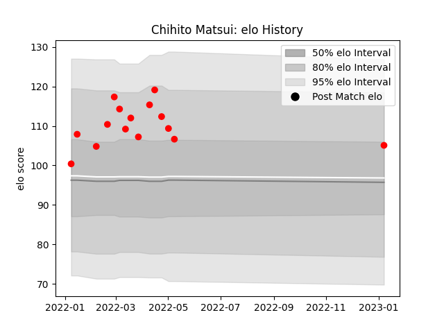

---  
layout: page  
title: Chihito Matsui  
date: 2023-01-13 11:37:41.709514  
categories: player  
---
# Chihito Matsui

## Positions: W

## Current elo: 105.0

## Current Percentile: 80.0

# Elo History

# Match History

| Team                  |   Appearances |   Win Rate |
|:----------------------|--------------:|-----------:|
| Yokohama Canon Eagles |            15 |        0.6 |

| Opponent                          |   Matches |   Win Rate |
|:----------------------------------|----------:|-----------:|
| Green Rockets Tokatsu             |         2 |        1   |
| Kobelco Kobe Steelers             |         2 |        0.5 |
| Kubota Spears Funabashi Tokyo-Bay |         2 |        0.5 |
| Tokyo Sungoliath                  |         2 |        0   |
| Black Rams Tokyo                  |         1 |        1   |
| NTT Docomo Red Hurricanes Osaka   |         1 |        1   |
| Saitama Wild Knights              |         1 |        0   |
| Shizuoka Blue Revs                |         1 |        1   |
| Toshiba Brave Lupus Tokyo         |         1 |        0   |
| Toyota Verblitz                   |         1 |        1   |
| Urayasu D-Rocks                   |         1 |        1   |