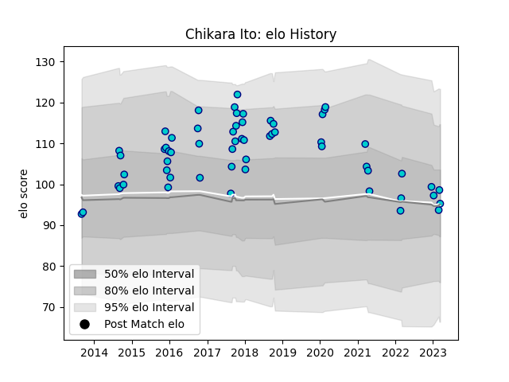

---  
layout: page  
title: Chikara Ito  
date: 2023-03-17 17:14:44.514536  
categories: player  
---
# Chikara Ito

## Positions: W

## Current elo: 95.0

## Current Percentile: 60.0

# Elo History

# Match History

| Team               |   Appearances |   Win Rate |
|:-------------------|--------------:|-----------:|
| Shizuoka Blue Revs |            59 |   0.627119 |

| Opponent                          |   Matches |   Win Rate |
|:----------------------------------|----------:|-----------:|
| Kubota Spears Funabashi Tokyo-Bay |         7 |   0.571429 |
| Kobelco Kobe Steelers             |         5 |   0.2      |
| Saitama Wild Knights              |         5 |   0.1      |
| Toshiba Brave Lupus Tokyo         |         5 |   0.4      |
| Toyota Verblitz                   |         5 |   0.8      |
| Yokohama Canon Eagles             |         5 |   0.5      |
| Black Rams Tokyo                  |         4 |   1        |
| Green Rockets Tokatsu             |         4 |   1        |
| Urayasu D-Rocks                   |         4 |   0.75     |
| Coca-Cola Red Sparks              |         3 |   1        |
| Tokyo Sungoliath                  |         3 |   0        |
| Toyota Industries Shuttles Aichi  |         3 |   1        |
| Munakata Sanix Blues              |         2 |   1        |
| NTT Docomo Red Hurricanes Osaka   |         2 |   1        |
| Mie Honda Heat                    |         1 |   1        |
| Mitsubishi Dynaboars              |         1 |   1        |