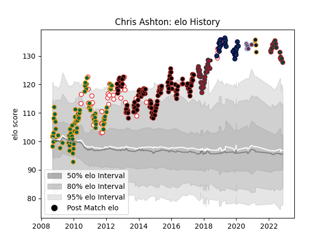

---  
layout: page  
title: Chris Ashton  
date: 2022-12-12 15:16:30.397666  
categories: player  
---
# Chris Ashton

## Positions: W

## Country: England

## Current elo: 125.0

## Current Percentile: 98.0

# Elo History

# Match History

| Team               |   Appearances |   Win Rate |
|:-------------------|--------------:|-----------:|
| Saracens           |           117 |   0.790598 |
| Northampton Saints |            84 |   0.720238 |
| England            |            42 |   0.630952 |
| Toulon             |            30 |   0.616667 |
| Sale Sharks        |            24 |   0.541667 |
| Leicester Tigers   |            18 |   0.75     |
| Harlequins         |             7 |   0.571429 |
| Worcester Warriors |             4 |   0        |
| Barbarians         |             1 |   1        |

| Opponent             |   Matches |   Win Rate |
|:---------------------|----------:|-----------:|
| Bath Rugby           |        21 |   0.666667 |
| Harlequins           |        18 |   0.777778 |
| Northampton Saints   |        17 |   0.705882 |
| Wasps                |        16 |   0.875    |
| Gloucester Rugby     |        16 |   0.6875   |
| Leicester Tigers     |        15 |   0.533333 |
| Sale Sharks          |        14 |   0.857143 |
| Exeter Chiefs        |        13 |   0.538462 |
| Newcastle Falcons    |        12 |   0.833333 |
| Worcester Warriors   |        12 |   0.75     |
| London Irish         |        10 |   0.9      |
| Saracens             |        10 |   0.5      |
| Munster              |        10 |   0.4      |
| Bristol Rugby        |         8 |   0.625    |
| Clermont Auvergne    |         7 |   0.571429 |
| Scarlets             |         6 |   0.583333 |
| France               |         6 |   0.666667 |
| Racing 92            |         6 |   0.666667 |
| South Africa         |         6 |   0.25     |
| New Zealand          |         5 |   0.2      |
| Ulster               |         5 |   1        |
| Australia            |         5 |   0.6      |
| La Rochelle          |         5 |   0.6      |
| Scotland             |         4 |   1        |
| Montpellier Herault  |         4 |   0.75     |
| Benetton Treviso     |         4 |   1        |
| Toulon               |         4 |   0.5      |
| Stade Toulousain     |         4 |   0.5      |
| Connacht             |         4 |   0.75     |
| Ireland              |         4 |   0.75     |
| Perpignan            |         4 |   0.75     |
| Oyonnax              |         4 |   0.75     |
| Italy                |         3 |   1        |
| Lyon                 |         3 |   0.5      |
| Leeds                |         3 |   1        |
| Wales                |         3 |   0.333333 |
| Edinburgh            |         3 |   1        |
| Castres Olympique    |         3 |   0.666667 |
| Yorkshire Carnegie   |         3 |   1        |
| Bordeaux Begles      |         3 |   0.666667 |
| Stade Francais Paris |         2 |   1        |
| Agen                 |         2 |   0.5      |
| London Welsh         |         2 |   1        |
| Ospreys              |         2 |   1        |
| Argentina            |         2 |   1        |
| Glasgow Warriors     |         2 |   0.5      |
| Cardiff Blues        |         2 |   1        |
| Zebre                |         2 |   1        |
| Samoa                |         1 |   1        |
| Romania              |         1 |   1        |
| Pau                  |         1 |   1        |
| Leinster             |         1 |   0        |
| Japan                |         1 |   1        |
| Georgia              |         1 |   1        |
| England              |         1 |   1        |
| Brive                |         1 |   1        |