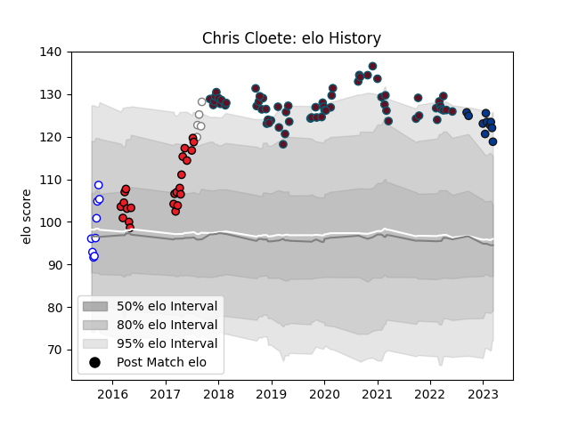

---  
layout: page  
title: Chris Cloete  
date: 2023-01-06 00:16:32.979507  
categories: player  
---
# Chris Cloete

## Positions: FL

## Current elo: 141.0

## Current Percentile: 99.0

# Elo History

# Match History

| Team             |   Appearances |   Win Rate |
|:-----------------|--------------:|-----------:|
| Munster          |            62 |   0.701613 |
| Southern Kings   |            23 |   0.304348 |
| Western Province |             9 |   0.666667 |
| Pumas            |             5 |   0.2      |
| Bath Rugby       |             3 |   0.333333 |

| Opponent                 |   Matches |   Win Rate |
|:-------------------------|----------:|-----------:|
| Leinster                 |         6 |   0.166667 |
| Cardiff Blues            |         6 |   0.666667 |
| Ulster                   |         6 |   0.333333 |
| Connacht                 |         5 |   1        |
| Zebre                    |         5 |   1        |
| Benetton Treviso         |         4 |   1        |
| Sharks                   |         4 |   0.5      |
| Lions                    |         4 |   0        |
| Glasgow Warriors         |         3 |   0.666667 |
| Southern Kings           |         3 |   1        |
| Ospreys                  |         3 |   1        |
| Castres Olympique        |         3 |   0.666667 |
| Jaguares                 |         3 |   0.333333 |
| Griquas                  |         3 |   1        |
| Bulls                    |         3 |   0.333333 |
| Free State Cheetahs      |         3 |   0.333333 |
| Edinburgh                |         3 |   1        |
| Dragons                  |         3 |   1        |
| Racing 92                |         2 |   0        |
| Cheetahs                 |         2 |   0.5      |
| Leicester Tigers         |         2 |   1        |
| Blue Bulls               |         2 |   0.5      |
| Scarlets                 |         2 |   1        |
| Natal Sharks             |         2 |   0.5      |
| Golden Lions             |         2 |   0        |
| Sunwolves                |         2 |   1        |
| Stormers                 |         1 |   0        |
| Wasps                    |         1 |   0        |
| Blues                    |         1 |   0        |
| Western Force            |         1 |   0        |
| Western Province         |         1 |   0        |
| Chiefs                   |         1 |   0        |
| Pumas                    |         1 |   1        |
| Saracens                 |         1 |   0        |
| Queensland Reds          |         1 |   0        |
| Bristol Rugby            |         1 |   0        |
| Newcastle Falcons        |         1 |   1        |
| New South Wales Waratahs |         1 |   1        |
| Crusaders                |         1 |   0        |
| Hurricanes               |         1 |   0        |
| Exeter Chiefs            |         1 |   0.5      |
| Melbourne Rebels         |         1 |   1        |