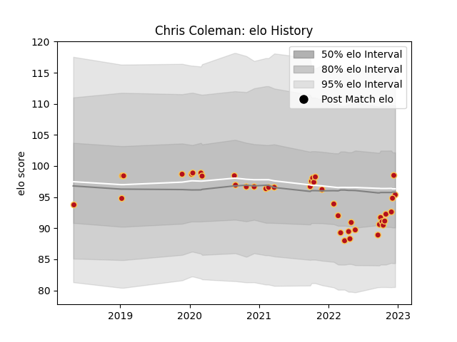

---  
layout: page  
title: Chris Coleman  
date: 2022-12-09 13:21:26.068210  
categories: player  
---
# Chris Coleman

## Positions: P

## Current elo: 95.0

## Current Percentile: 27.0

# Elo History

# Match History

| Team    |   Appearances |   Win Rate |
|:--------|--------------:|-----------:|
| Dragons |            39 |   0.307692 |

| Opponent           |   Matches |   Win Rate |
|:-------------------|----------:|-----------:|
| Scarlets           |         5 |   0.2      |
| Benetton Treviso   |         3 |   0.166667 |
| Ospreys            |         3 |   0.5      |
| Leinster           |         2 |   0        |
| Ulster             |         2 |   0        |
| Stormers           |         2 |   0        |
| RC Enisei          |         2 |   1        |
| Munster            |         2 |   0.5      |
| Lions              |         2 |   0        |
| Glasgow Warriors   |         2 |   1        |
| Edinburgh          |         2 |   0        |
| Connacht           |         2 |   0.5      |
| Cardiff Blues      |         2 |   0        |
| Zebre              |         2 |   0.5      |
| Bulls              |         1 |   0        |
| Clermont Auvergne  |         1 |   0        |
| Cheetahs           |         1 |   1        |
| Sharks             |         1 |   0        |
| Castres Olympique  |         1 |   0        |
| Timisoara Saracens |         1 |   1        |