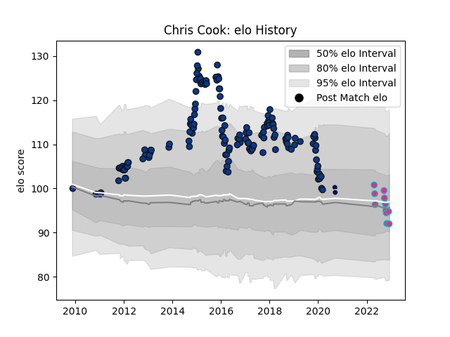

---  
layout: page  
title: Chris Cook  
date: 2023-01-21 15:46:16.709853  
categories: player  
---
# Chris Cook

## Positions: SH

## Current elo: 86.0

## Current Percentile: 17.0

# Elo History

# Match History

| Team          |   Appearances |   Win Rate |
|:--------------|--------------:|-----------:|
| Bath Rugby    |           157 |  0.566879  |
| Zebre         |            13 |  0.0769231 |
| Bristol Rugby |             2 |  0.5       |

| Opponent             |   Matches |   Win Rate |
|:---------------------|----------:|-----------:|
| Exeter Chiefs        |        13 |   0.461538 |
| Northampton Saints   |        12 |   0.666667 |
| Harlequins           |        12 |   0.5      |
| Sale Sharks          |        11 |   0.636364 |
| Wasps                |        11 |   0.363636 |
| Gloucester Rugby     |        11 |   0.636364 |
| Saracens             |        10 |   0.2      |
| Leicester Tigers     |         9 |   0.666667 |
| Newcastle Falcons    |         9 |   0.444444 |
| Worcester Warriors   |         8 |   0.875    |
| London Irish         |         8 |   1        |
| Leinster             |         5 |   0.2      |
| Toulon               |         5 |   0.2      |
| Bristol Rugby        |         5 |   0.4      |
| Stade Toulousain     |         4 |   0.25     |
| Dragons              |         4 |   0.75     |
| Glasgow Warriors     |         3 |   0.666667 |
| Montpellier Herault  |         3 |   0.666667 |
| Ulster               |         3 |   0        |
| London Welsh         |         3 |   1        |
| Edinburgh            |         2 |   0        |
| Clermont Auvergne    |         2 |   0        |
| Ospreys              |         2 |   0.5      |
| Pau                  |         2 |   1        |
| Cardiff Blues        |         2 |   0.5      |
| Bucuresti            |         2 |   1        |
| Scarlets             |         2 |   0        |
| Benetton Treviso     |         2 |   0.5      |
| Stormers             |         1 |   0        |
| Agen                 |         1 |   1        |
| Stade Francais Paris |         1 |   0        |
| Sharks               |         1 |   0        |
| Aironi               |         1 |   1        |
| Brive                |         1 |   1        |
| Yorkshire Carnegie   |         1 |   1        |