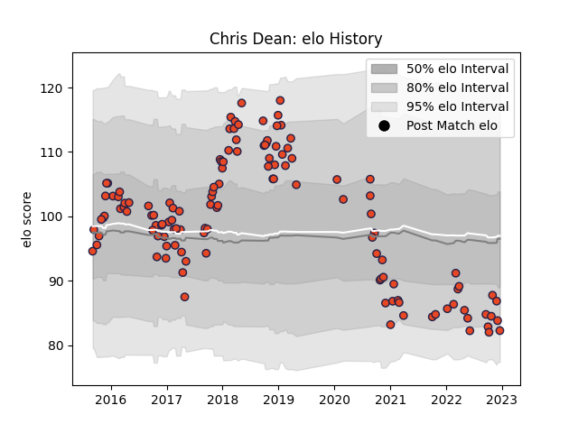

---  
layout: page  
title: Chris Dean  
date: 2023-02-24 02:25:47.087582  
categories: player  
---
# Chris Dean

## Positions: C

## Current elo: 95.0

## Current Percentile: 29.0

# Elo History

# Match History

| Team      |   Appearances |   Win Rate |
|:----------|--------------:|-----------:|
| Edinburgh |           129 |    0.51938 |

| Opponent               |   Matches |   Win Rate |
|:-----------------------|----------:|-----------:|
| Glasgow Warriors       |        15 |   0.533333 |
| Dragons                |        10 |   0.7      |
| Ulster                 |         9 |   0.333333 |
| Munster                |         9 |   0.111111 |
| Cardiff Blues          |         8 |   0.625    |
| Benetton Treviso       |         8 |   0.5      |
| Zebre                  |         7 |   0.714286 |
| Leinster               |         7 |   0.428571 |
| Connacht               |         7 |   0.285714 |
| Scarlets               |         7 |   0.571429 |
| Ospreys                |         6 |   0.333333 |
| London Irish           |         4 |   0.5      |
| Southern Kings         |         3 |   0.666667 |
| Agen                   |         3 |   1        |
| Montpellier Herault    |         2 |   0.5      |
| Stormers               |         2 |   0        |
| Krasny Yar             |         2 |   1        |
| Newcastle Falcons      |         2 |   1        |
| Harlequins             |         2 |   1        |
| Toulon                 |         2 |   1        |
| La Rochelle            |         2 |   0        |
| Cheetahs               |         2 |   0.5      |
| Wasps                  |         1 |   0        |
| Bordeaux Begles        |         1 |   0        |
| Timisoara Saracens     |         1 |   1        |
| Lions                  |         1 |   0        |
| Stade Francais Paris   |         1 |   0        |
| Grenoble               |         1 |   1        |
| Sale Sharks            |         1 |   1        |
| Pau                    |         1 |   1        |
| Krasny Yar Krasnoyarsk |         1 |   1        |
| Sharks                 |         1 |   1        |