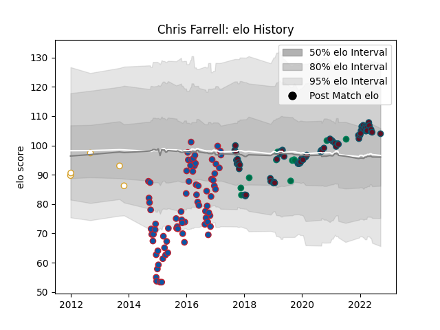

---  
layout: page  
title: Chris Farrell  
date: 2023-03-27 11:34:44.687169  
categories: player  
---
# Chris Farrell

Last updated: 2023-03-27
## Positions: C

## Country: Ireland

## Current elo: 104.0

## Current Percentile: 71.0

# Elo History

# Match History

| Team     |   Appearances |   Win Rate |
|:---------|--------------:|-----------:|
| Grenoble |            76 |   0.407895 |
| Munster  |            71 |   0.640845 |
| Ireland  |            11 |   0.818182 |
| Ulster   |             5 |   0.4      |

| Opponent             |   Matches |   Win Rate |
|:---------------------|----------:|-----------:|
| Leinster             |        11 |   0        |
| Racing 92            |        10 |   0.35     |
| Connacht             |        10 |   0.8      |
| Castres Olympique    |         9 |   0.5      |
| Stade Toulousain     |         8 |   0.4375   |
| Edinburgh            |         6 |   0.833333 |
| Brive                |         6 |   0.5      |
| La Rochelle          |         6 |   0.333333 |
| Stade Francais Paris |         5 |   0.6      |
| Clermont Auvergne    |         5 |   0.2      |
| Cardiff Blues        |         5 |   0.6      |
| Bordeaux Begles      |         5 |   0        |
| Toulon               |         4 |   0.25     |
| Ulster               |         4 |   0.75     |
| Pau                  |         4 |   0.25     |
| Scarlets             |         3 |   0.666667 |
| Saracens             |         3 |   0.333333 |
| Oyonnax              |         3 |   0.666667 |
| Ospreys              |         3 |   0.666667 |
| Montpellier Herault  |         3 |   0.333333 |
| Agen                 |         3 |   1        |
| Zebre                |         3 |   1        |
| Bayonne              |         3 |   0.666667 |
| Benetton Treviso     |         3 |   1        |
| Dragons              |         3 |   0.666667 |
| Exeter Chiefs        |         3 |   0.666667 |
| Glasgow Warriors     |         3 |   0.333333 |
| Italy                |         2 |   1        |
| Wasps                |         2 |   1        |
| Wales                |         2 |   1        |
| Southern Kings       |         2 |   1        |
| Scotland             |         2 |   1        |
| Japan                |         2 |   0.5      |
| Harlequins           |         2 |   0.5      |
| Lyon                 |         2 |   0.5      |
| Rovigo               |         2 |   1        |
| Fiji                 |         1 |   1        |
| France               |         1 |   0        |
| Rugby Rovigo         |         1 |   1        |
| Gloucester Rugby     |         1 |   1        |
| Newcastle Falcons    |         1 |   0        |
| Munster              |         1 |   1        |
| Cheetahs             |         1 |   1        |
| Bulls                |         1 |   0        |
| London Irish         |         1 |   1        |
| Lions                |         1 |   0        |
| Argentina            |         1 |   1        |