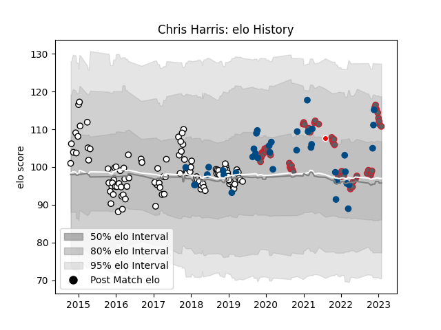

---  
layout: page  
title: Chris Harris  
date: 2023-03-21 18:38:37.103572  
categories: player  
---
# Chris Harris

Last updated: 2023-03-21
## Positions: C

## Country: Scotland

## Current elo: 109.0

## Current Percentile: 80.0

# Elo History

# Match History

| Team                    |   Appearances |   Win Rate |
|:------------------------|--------------:|-----------:|
| Newcastle Falcons       |           104 |   0.408654 |
| Gloucester Rugby        |            63 |   0.5      |
| Scotland                |            40 |   0.6375   |
| British and Irish Lions |             1 |   0        |

| Opponent               |   Matches |   Win Rate |
|:-----------------------|----------:|-----------:|
| Exeter Chiefs          |        14 |   0.142857 |
| Bath Rugby             |        13 |   0.538462 |
| Saracens               |        13 |   0.153846 |
| Harlequins             |        12 |   0.333333 |
| Northampton Saints     |        11 |   0.545455 |
| Sale Sharks            |        11 |   0.5      |
| Leicester Tigers       |        10 |   0.3      |
| Worcester Warriors     |        10 |   0.7      |
| London Irish           |        10 |   0.75     |
| Gloucester Rugby       |         8 |   0.25     |
| Bristol Rugby          |         8 |   0.375    |
| Wasps                  |         7 |   0.285714 |
| France                 |         5 |   0.8      |
| Ireland                |         5 |   0        |
| Wales                  |         5 |   0.4      |
| England                |         5 |   0.7      |
| Montpellier Herault    |         4 |   0.5      |
| Dragons                |         4 |   0.75     |
| Newcastle Falcons      |         4 |   0.75     |
| Connacht               |         4 |   0.5      |
| Italy                  |         4 |   1        |
| South Africa           |         3 |   0        |
| Brive                  |         3 |   0.666667 |
| Samoa                  |         2 |   1        |
| Stade Francais Paris   |         2 |   0.5      |
| Argentina              |         2 |   1        |
| Japan                  |         2 |   0.5      |
| Edinburgh              |         2 |   0        |
| Bordeaux Begles        |         2 |   1        |
| Georgia                |         2 |   1        |
| Fiji                   |         2 |   1        |
| Benetton Treviso       |         1 |   1        |
| Ulster                 |         1 |   1        |
| Toulon                 |         1 |   0        |
| Stade Toulousain       |         1 |   0        |
| Bucarest Wolves        |         1 |   1        |
| Bucuresti              |         1 |   1        |
| Canada                 |         1 |   1        |
| Cardiff Blues          |         1 |   0        |
| La Rochelle            |         1 |   0        |
| Australia              |         1 |   1        |
| RC Enisei              |         1 |   1        |
| Perpignan              |         1 |   1        |
| Ospreys                |         1 |   0        |
| Enisey-STM Krasnoyarsk |         1 |   1        |
| New Zealand            |         1 |   0        |
| London Welsh           |         1 |   1        |
| Grenoble               |         1 |   0        |
| Leinster               |         1 |   0        |
| Russia                 |         1 |   1        |