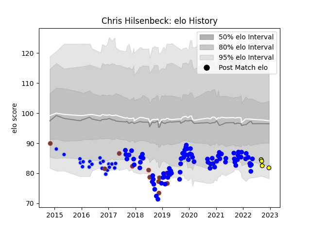

---  
layout: page  
title: Chris Hilsenbeck  
date: 2023-02-02 18:49:25.740244  
categories: player  
---
# Chris Hilsenbeck

## Positions: FH

## Country: Germany

## Current elo: 93.0

## Current Percentile: 39.0

# Elo History

# Match History

| Team        |   Appearances |   Win Rate |
|:------------|--------------:|-----------:|
| Vannes      |           117 |   0.551282 |
| Colomiers   |            50 |   0.57     |
| Germany     |            11 |   0.363636 |
| Carcassonne |             7 |   0.5      |

| Opponent                   |   Matches |   Win Rate |
|:---------------------------|----------:|-----------:|
| Aurillac                   |        14 |   0.714286 |
| Mont-de-Marsan             |        11 |   0.636364 |
| Montauban                  |        11 |   0.636364 |
| Beziers                    |        11 |   0.545455 |
| Biarritz Olympique         |        10 |   0.6      |
| Carcassonne                |        10 |   0.5      |
| Soyaux-Angouleme           |         9 |   0.666667 |
| Provence Rugby             |         9 |   0.666667 |
| Colomiers                  |         9 |   0.555556 |
| Nevers                     |         8 |   0.5625   |
| Narbonne                   |         8 |   0.5625   |
| Perpignan                  |         7 |   0.357143 |
| Oyonnax                    |         7 |   0.428571 |
| Rouen                      |         6 |   0.5      |
| Grenoble                   |         6 |   0.416667 |
| Agen                       |         5 |   0.4      |
| US Bressane                |         4 |   0.875    |
| Bayonne                    |         4 |   0.5      |
| Dax                        |         4 |   0.5      |
| Vannes                     |         3 |   0.333333 |
| Massy                      |         3 |   0.666667 |
| Lyon                       |         2 |   0.5      |
| Tarbes                     |         2 |   0        |
| Samoa                      |         2 |   0        |
| Roval Drome XV             |         2 |   1        |
| Bourgoin-Jallieu           |         2 |   1        |
| Brive                      |         2 |   0        |
| Kenya                      |         2 |   1        |
| Albi                       |         2 |   0        |
| Canada                     |         1 |   0        |
| Pau                        |         1 |   0        |
| Georgia                    |         1 |   0        |
| Russia                     |         1 |   0        |
| Hong Kong                  |         1 |   1        |
| Namibia                    |         1 |   0        |
| United States of America   |         1 |   0        |
| Uruguay                    |         1 |   1        |
| Valence Romans Drome Rugby |         1 |   1        |
| La Rochelle                |         1 |   0        |