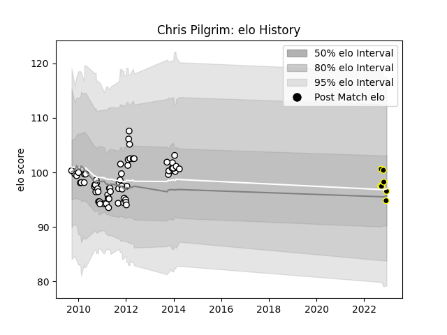

---  
layout: page  
title: Chris Pilgrim  
date: 2023-02-02 19:03:48.316641  
categories: player  
---
# Chris Pilgrim

## Positions: SH

## Current elo: 101.0

## Current Percentile: 56.0

# Elo History

# Match History

| Team              |   Appearances |   Win Rate |
|:------------------|--------------:|-----------:|
| Newcastle Falcons |            68 |   0.323529 |
| Caldy             |            11 |   0.545455 |

| Opponent            |   Matches |   Win Rate |
|:--------------------|----------:|-----------:|
| Leicester Tigers    |         7 |   0        |
| Bath Rugby          |         6 |   0        |
| Wasps               |         5 |   0.8      |
| Harlequins          |         5 |   0.3      |
| Saracens            |         5 |   0        |
| Northampton Saints  |         5 |   0        |
| Gloucester Rugby    |         5 |   0.6      |
| London Irish        |         4 |   0.5      |
| Sale Sharks         |         4 |   0.5      |
| Exeter Chiefs       |         3 |   0        |
| Worcester Warriors  |         3 |   0.166667 |
| Richmond            |         2 |   1        |
| Nottingham          |         2 |   0.5      |
| Toulon              |         2 |   0.5      |
| Calvisano           |         2 |   1        |
| Bucuresti           |         2 |   1        |
| Brive               |         2 |   0        |
| Petrarca Padova     |         1 |   1        |
| Ospreys             |         1 |   1        |
| Ampthill            |         1 |   0        |
| Leeds               |         1 |   0        |
| Montpellier Herault |         1 |   0        |
| London Scottish     |         1 |   0        |
| Hartpury College    |         1 |   0        |
| Ealing Trailfinders |         1 |   1        |
| Dragons             |         1 |   1        |
| Coventry            |         1 |   0        |
| Cornish Pirates     |         1 |   1        |
| Cardiff Blues       |         1 |   0        |
| Bourgoin-Jallieu    |         1 |   1        |
| Bedford             |         1 |   1        |
| Yorkshire Carnegie  |         1 |   0        |