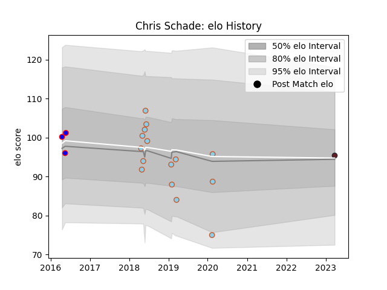

---  
layout: page  
title: Chris Schade  
date: 2023-03-27 11:32:44.790837  
categories: player  
---
# Chris Schade

Last updated: 2023-03-27
## Positions: P, H

## Current elo: 96.0

## Current Percentile: None

# Elo History

# Match History

| Team               |   Appearances |   Win Rate |
|:-------------------|--------------:|-----------:|
| Austin Elite Rugby |            12 |   0.25     |
| Austin Herd        |             3 |   0        |
| Ohio               |             3 |   0.333333 |
| American Raptors   |             1 |   0        |

| Opponent          |   Matches |   Win Rate |
|:------------------|----------:|-----------:|
| Utah Warriors     |         3 |   0.333333 |
| Glendale Raptors  |         2 |   0        |
| Houston SaberCats |         2 |   0        |
| San Diego Legion  |         2 |   0.5      |
| Seattle Seawolves |         2 |   0        |
| Denver            |         1 |   0        |
| Dogos XV          |         1 |   0        |
| NOLA Gold         |         1 |   1        |
| R.U. New York     |         1 |   0        |
| Rugby New York    |         1 |   0        |
| Sacramento        |         1 |   1        |
| San Diego         |         1 |   0        |
| Toronto Arrows    |         1 |   0        |