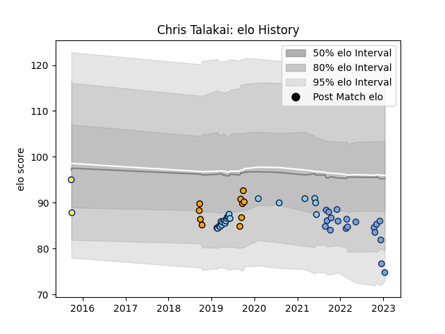

---  
layout: page  
title: Chris Talakai  
date: 2023-01-15 11:41:59.870238  
categories: player  
---
# Chris Talakai

## Positions: P

## Current elo: 75.0

## Current Percentile: 7.0

# Elo History

# Match History

| Team                     |   Appearances |   Win Rate |
|:-------------------------|--------------:|-----------:|
| New South Wales Waratahs |            21 |   0.285714 |
| Bayonne                  |            19 |   0.631579 |
| NSW Country Eagles       |            10 |   0.45     |
| Sydney Stars             |             2 |   0.5      |

| Opponent            |   Matches |   Win Rate |
|:--------------------|----------:|-----------:|
| Melbourne Rebels    |         3 |   0.666667 |
| Crusaders           |         3 |   0.333333 |
| Western Force       |         2 |   0.5      |
| Queensland Reds     |         2 |   1        |
| Benetton Treviso    |         2 |   0        |
| Beziers             |         2 |   0.5      |
| Brisbane City       |         2 |   0        |
| Brumbies            |         2 |   0        |
| Sydney Rays         |         2 |   1        |
| Sunwolves           |         2 |   0.5      |
| Colomiers           |         2 |   0.5      |
| Fijian Drua         |         2 |   0.25     |
| Queensland Country  |         2 |   0        |
| Montauban           |         1 |   1        |
| Perpignan           |         1 |   1        |
| Provence Rugby      |         1 |   0        |
| Scarlets            |         1 |   0        |
| Rouen               |         1 |   1        |
| Sharks              |         1 |   0        |
| US Bressane         |         1 |   1        |
| Vannes              |         1 |   1        |
| Melbourne Rising    |         1 |   1        |
| Agen                |         1 |   1        |
| Lyon                |         1 |   1        |
| Lions               |         1 |   0        |
| Jaguares            |         1 |   0        |
| Aurillac            |         1 |   1        |
| Highlanders         |         1 |   0        |
| Grenoble            |         1 |   1        |
| Greater Sydney Rams |         1 |   1        |
| Clermont Auvergne   |         1 |   1        |
| Chiefs              |         1 |   0        |
| Castres Olympique   |         1 |   0        |
| Canberra Vikings    |         1 |   0        |
| Bulls               |         1 |   0        |
| Blues               |         1 |   0        |
| Hurricanes          |         1 |   0        |