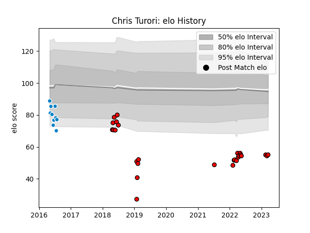

---  
layout: page  
title: Chris Turori  
date: 2023-03-21 18:28:28.442494  
categories: player  
---
# Chris Turori

Last updated: 2023-03-21
## Positions: FL, L

## Current elo: 55.0

## Current Percentile: None

# Elo History

# Match History

| Team             |   Appearances |   Win Rate |
|:-----------------|--------------:|-----------:|
| San Diego Legion |            27 |   0.555556 |
| San Diego        |            10 |   0.3      |

| Opponent           |   Matches |   Win Rate |
|:-------------------|----------:|-----------:|
| Seattle Seawolves  |         6 |   0.333333 |
| Houston SaberCats  |         5 |   0.6      |
| Utah Warriors      |         5 |   1        |
| Ohio               |         3 |   0.333333 |
| San Francisco      |         3 |   0.333333 |
| Austin Elite Rugby |         2 |   0.5      |
| Denver             |         2 |   0        |
| L. A. Giltinis     |         2 |   0.5      |
| Sacramento         |         2 |   0.5      |
| Austin Gilgronis   |         1 |   0        |
| Dallas Jackals     |         1 |   1        |
| Glendale Raptors   |         1 |   0        |
| NOLA Gold          |         1 |   1        |
| R.U. New York      |         1 |   0        |
| Rugby ATL          |         1 |   1        |
| Rugby New York     |         1 |   0        |