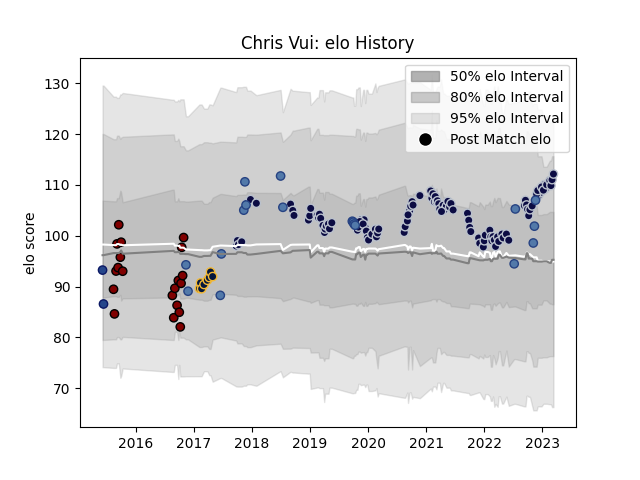

---  
layout: page  
title: Chris Vui  
date: 2023-01-06 00:22:36.155683  
categories: player  
---
# Chris Vui

## Positions: L, FL

## Country: Samoa

## Current elo: 115.0

## Current Percentile: 80.0

# Elo History

# Match History

| Team               |   Appearances |   Win Rate |
|:-------------------|--------------:|-----------:|
| Bristol Rugby      |           100 |   0.6      |
| North Harbour      |            20 |   0.475    |
| Samoa              |            18 |   0.444444 |
| Worcester Warriors |             8 |   0.5      |
| Blues              |             2 |   0        |

| Opponent             |   Matches |   Win Rate |
|:---------------------|----------:|-----------:|
| Bath Rugby           |        10 |   0.8      |
| Wasps                |         9 |   0.333333 |
| Harlequins           |         9 |   0.444444 |
| Sale Sharks          |         9 |   0.277778 |
| Gloucester Rugby     |         9 |   0.666667 |
| Northampton Saints   |         7 |   0.571429 |
| Leicester Tigers     |         7 |   0.5      |
| Exeter Chiefs        |         7 |   0.285714 |
| Newcastle Falcons    |         6 |   0.666667 |
| Saracens             |         6 |   0.5      |
| London Irish         |         5 |   0.6      |
| Worcester Warriors   |         5 |   0.6      |
| Wellington           |         3 |   0.333333 |
| Stade Francais Paris |         3 |   1        |
| Otago                |         3 |   0.333333 |
| Northland            |         2 |   1        |
| Tasman               |         2 |   0.25     |
| Romania              |         2 |   0.5      |
| Scotland             |         2 |   0        |
| Southland            |         2 |   1        |
| Bay of Plenty        |         2 |   0.5      |
| Zebre                |         2 |   1        |
| Bedford              |         2 |   1        |
| Counties Manukau     |         2 |   1        |
| Germany              |         2 |   1        |
| Hawke's Bay          |         1 |   0        |
| Canterbury           |         1 |   0        |
| Crusaders            |         1 |   0        |
| Scarlets             |         1 |   1        |
| Cornish Pirates      |         1 |   1        |
| Cardiff Blues        |         1 |   1        |
| Tonga                |         1 |   1        |
| Canada               |         1 |   1        |
| Doncaster            |         1 |   1        |
| Waikato              |         1 |   0        |
| Wales                |         1 |   0        |
| Bristol Rugby        |         1 |   1        |
| Bordeaux Begles      |         1 |   1        |
| Russia               |         1 |   1        |
| Perpignan            |         1 |   1        |
| Highlanders          |         1 |   0        |
| Dragons              |         1 |   1        |
| Ealing Trailfinders  |         1 |   1        |
| England              |         1 |   0        |
| Fiji                 |         1 |   1        |
| New Zealand          |         1 |   0        |
| Manawatu             |         1 |   0        |
| London Scottish      |         1 |   1        |
| France               |         1 |   0        |
| Georgia              |         1 |   1        |
| La Rochelle          |         1 |   0        |
| Japan                |         1 |   0        |
| Italy                |         1 |   0        |
| Ireland              |         1 |   0        |
| Jersey               |         1 |   1        |