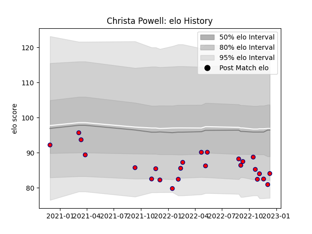

---  
layout: page  
title: Christa Powell  
date: 2022-12-09 13:18:54.526325  
categories: player  
---
# Christa Powell

## Positions: C

## Current elo: 81.0

## Current Percentile: 10.0

# Elo History

# Match History

| Team     |   Appearances |   Win Rate |
|:---------|--------------:|-----------:|
| Aurillac |            24 |   0.416667 |

| Opponent                   |   Matches |   Win Rate |
|:---------------------------|----------:|-----------:|
| Colomiers                  |         3 |   0.666667 |
| Nevers                     |         2 |   0.5      |
| Carcassonne                |         2 |   0        |
| Mont-de-Marsan             |         2 |   0        |
| Montauban                  |         2 |   1        |
| Oyonnax                    |         2 |   0.5      |
| Provence Rugby             |         1 |   1        |
| Valence Romans Drome Rugby |         1 |   0        |
| US Bressane                |         1 |   0        |
| Soyaux-Angouleme           |         1 |   1        |
| Rouen                      |         1 |   1        |
| Bayonne                    |         1 |   0        |
| Perpignan                  |         1 |   0        |
| Beziers                    |         1 |   1        |
| Grenoble                   |         1 |   0        |
| Biarritz Olympique         |         1 |   0        |
| Vannes                     |         1 |   0        |