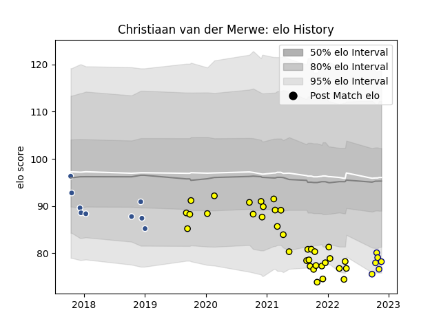

---  
layout: page  
title: Christiaan van der Merwe  
date: 2023-02-02 18:59:03.085053  
categories: player  
---
# Christiaan van der Merwe

## Positions: L

## Current elo: 65.0

## Current Percentile: 2.0

# Elo History

# Match History

| Team        |   Appearances |   Win Rate |
|:------------|--------------:|-----------:|
| Carcassonne |            65 |   0.569231 |
| Agen        |            10 |   0.3      |
| Nevers      |             9 |   0.222222 |

| Opponent                   |   Matches |   Win Rate |
|:---------------------------|----------:|-----------:|
| Grenoble                   |         6 |   0.5      |
| Vannes                     |         6 |   0.5      |
| Nevers                     |         6 |   0.5      |
| Aurillac                   |         6 |   0.5      |
| Mont-de-Marsan             |         6 |   0.333333 |
| Montauban                  |         5 |   0.8      |
| Provence Rugby             |         5 |   0.4      |
| Rouen                      |         4 |   1        |
| Oyonnax                    |         4 |   0        |
| Colomiers                  |         4 |   0.5      |
| Beziers                    |         4 |   0.75     |
| Biarritz Olympique         |         3 |   0.333333 |
| Perpignan                  |         3 |   0.333333 |
| Pau                        |         2 |   0        |
| US Bressane                |         2 |   1        |
| Valence Romans Drome Rugby |         2 |   0        |
| Soyaux-Angouleme           |         2 |   1        |
| Agen                       |         2 |   0.5      |
| Narbonne                   |         2 |   1        |
| Gloucester Rugby           |         2 |   0        |
| Bayonne                    |         2 |   0.5      |
| Lyon                       |         1 |   0        |
| Harlequins                 |         1 |   0        |
| Roval Drome XV             |         1 |   1        |
| Dax                        |         1 |   1        |
| Carcassonne                |         1 |   0        |
| Zebre                      |         1 |   1        |