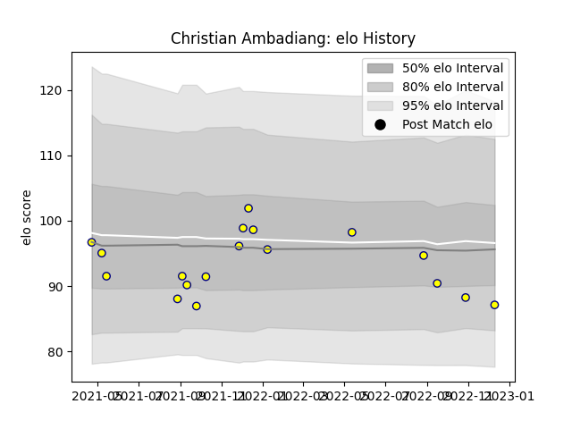

---  
layout: page  
title: Christian Ambadiang  
date: 2022-12-18 16:25:04.646727  
categories: player  
---
# Christian Ambadiang

## Positions: W

## Current elo: 87.0

## Current Percentile: 19.0

# Elo History

# Match History

| Team   |   Appearances |   Win Rate |
|:-------|--------------:|-----------:|
| Nevers |            18 |   0.472222 |

| Opponent                   |   Matches |   Win Rate |
|:---------------------------|----------:|-----------:|
| Beziers                    |         2 |        0.5 |
| Carcassonne                |         2 |        0   |
| Montauban                  |         2 |        0.5 |
| Vannes                     |         2 |        0.5 |
| Agen                       |         1 |        1   |
| Biarritz Olympique         |         1 |        0.5 |
| Colomiers                  |         1 |        1   |
| Grenoble                   |         1 |        0   |
| Oyonnax                    |         1 |        1   |
| Perpignan                  |         1 |        0   |
| Provence Rugby             |         1 |        0   |
| Rouen                      |         1 |        1   |
| US Bressane                |         1 |        1   |
| Valence Romans Drome Rugby |         1 |        0   |