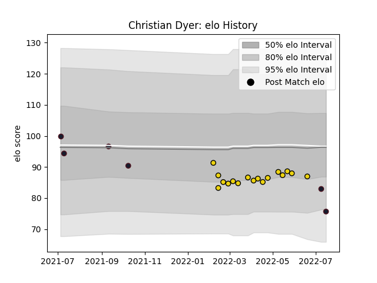

---  
layout: page  
title: Christian Dyer  
date: 2023-03-17 17:31:36.507081  
categories: player  
---
# Christian Dyer

## Positions: C, W

## Country: United States of America

## Current elo: 76.0

## Current Percentile: 18.0

# Elo History

# Match History

| Team                     |   Appearances |   Win Rate |
|:-------------------------|--------------:|-----------:|
| Houston SaberCats        |            17 |   0.529412 |
| United States of America |             6 |   0.333333 |

| Opponent          |   Matches |   Win Rate |
|:------------------|----------:|-----------:|
| Seattle Seawolves |         3 |   0.333333 |
| Chile             |         2 |   0.5      |
| Dallas Jackals    |         2 |   1        |
| L. A. Giltinis    |         2 |   0.5      |
| San Diego Legion  |         2 |   0.5      |
| Utah Warriors     |         2 |   1        |
| Austin Gilgronis  |         1 |   0        |
| Canada            |         1 |   1        |
| England           |         1 |   0        |
| Ireland           |         1 |   0        |
| Old Glory DC      |         1 |   1        |
| R.U. New York     |         1 |   0        |
| Rugby ATL         |         1 |   0        |
| Rugby New York    |         1 |   0        |
| Toronto Arrows    |         1 |   1        |
| Uruguay           |         1 |   0        |