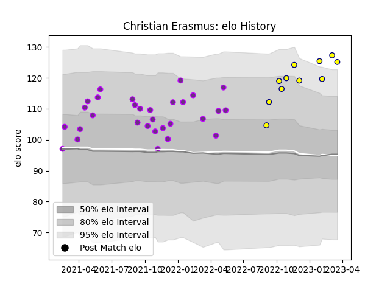

---  
layout: page  
title: Christian Erasmus  
date: 2023-01-30 11:46:50.922277  
categories: player  
---
# Christian Erasmus

## Positions: W

## Current elo: 111.0

## Current Percentile: 76.0

# Elo History

# Match History

| Team        |   Appearances |   Win Rate |
|:------------|--------------:|-----------:|
| US Bressane |            29 |   0.551724 |
| Nevers      |             8 |   0.625    |

| Opponent                   |   Matches |   Win Rate |
|:---------------------------|----------:|-----------:|
| Beziers                    |         3 |   1        |
| Rouen                      |         3 |   0.833333 |
| Colomiers                  |         3 |   0.333333 |
| Grenoble                   |         3 |   0.333333 |
| Vannes                     |         2 |   0.5      |
| Narbonne                   |         2 |   1        |
| Aurillac                   |         2 |   0        |
| Provence Rugby             |         2 |   0.25     |
| Mont-de-Marsan             |         2 |   0        |
| Tarbes                     |         1 |   1        |
| Suresnes                   |         1 |   1        |
| Soyaux-Angouleme           |         1 |   1        |
| Oyonnax                    |         1 |   0        |
| Nevers                     |         1 |   0        |
| Agen                       |         1 |   1        |
| Montauban                  |         1 |   0        |
| Aubenas                    |         1 |   1        |
| Dax                        |         1 |   1        |
| Cognac Saint Jean d'Angély |         1 |   1        |
| Chambery                   |         1 |   1        |
| Carcassonne                |         1 |   0        |
| Bourgoin-Jallieu           |         1 |   1        |
| Bayonne                    |         1 |   0        |
| Massy                      |         1 |   1        |