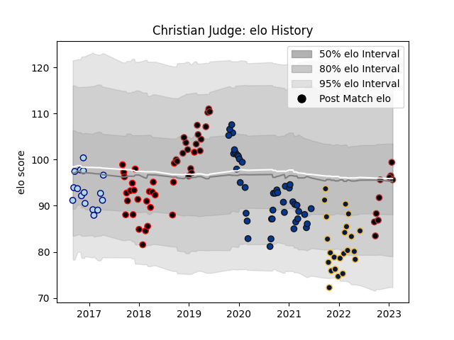

---  
layout: page  
title: Christian Judge  
date: 2023-01-06 00:12:59.696434  
categories: player  
---
# Christian Judge

## Positions: P

## Current elo: 111.0

## Current Percentile: 74.0

# Elo History

# Match History

| Team               |   Appearances |   Win Rate |
|:-------------------|--------------:|-----------:|
| Bath Rugby         |            42 |   0.464286 |
| Cornish Pirates    |            26 |   0.615385 |
| Saracens           |            24 |   0.833333 |
| Worcester Warriors |            23 |   0.282609 |
| Bedford            |            16 |   0.34375  |

| Opponent            |   Matches |   Win Rate |
|:--------------------|----------:|-----------:|
| Exeter Chiefs       |        11 |   0.454545 |
| Harlequins          |        10 |   0.5      |
| Bristol Rugby       |         8 |   0.125    |
| Leicester Tigers    |         7 |   0.571429 |
| Gloucester Rugby    |         7 |   0.571429 |
| Sale Sharks         |         7 |   0.714286 |
| Northampton Saints  |         7 |   0.714286 |
| Worcester Warriors  |         5 |   0.8      |
| Wasps               |         5 |   0.2      |
| London Irish        |         5 |   0.6      |
| Bath Rugby          |         5 |   0.6      |
| Yorkshire Carnegie  |         4 |   0.25     |
| Doncaster           |         4 |   0.75     |
| London Scottish     |         4 |   0.5      |
| Saracens            |         4 |   0.125    |
| Newcastle Falcons   |         4 |   0.375    |
| Nottingham          |         4 |   0.25     |
| Richmond            |         4 |   0.75     |
| Rotherham Titans    |         3 |   0.666667 |
| Hartpury College    |         3 |   1        |
| Jersey              |         3 |   0        |
| Ealing Trailfinders |         3 |   0.333333 |
| Clermont Auvergne   |         2 |   0        |
| Cornish Pirates     |         2 |   0.25     |
| Glasgow Warriors    |         2 |   1        |
| London Welsh        |         2 |   1        |
| Bedford             |         2 |   1        |
| Lyon                |         1 |   1        |
| Ulster              |         1 |   0        |
| Cardiff Blues       |         1 |   1        |
| Coventry            |         1 |   1        |