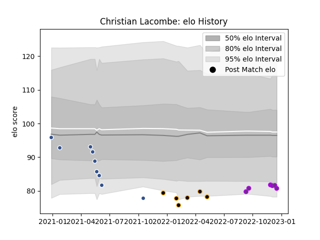

---  
layout: page  
title: Christian Lacombe  
date: 2022-12-18 16:29:14.104245  
categories: player  
---
# Christian Lacombe

## Positions: FH

## Current elo: 81.0

## Current Percentile: 8.0

# Elo History

# Match History

| Team        |   Appearances |   Win Rate |
|:------------|--------------:|-----------:|
| Agen        |             9 |   0        |
| Chambery    |             6 |   0.333333 |
| US Bressane |             6 |   0.666667 |

| Opponent                   |   Matches |   Win Rate |
|:---------------------------|----------:|-----------:|
| Cognac Saint Jean d'Angély |         3 |   0.666667 |
| Dax                        |         2 |   0        |
| Racing 92                  |         2 |   0        |
| Valence Romans Drome Rugby |         2 |   0.5      |
| Albi                       |         1 |   0        |
| Bordeaux Begles            |         1 |   0        |
| Chambery                   |         1 |   1        |
| La Rochelle                |         1 |   0        |
| Lyon                       |         1 |   0        |
| Massy                      |         1 |   0        |
| Pau                        |         1 |   0        |
| Soyaux-Angouleme           |         1 |   1        |
| Stade Toulousain           |         1 |   0        |
| Tarbes                     |         1 |   1        |
| Toulon                     |         1 |   0        |
| Vannes                     |         1 |   0        |