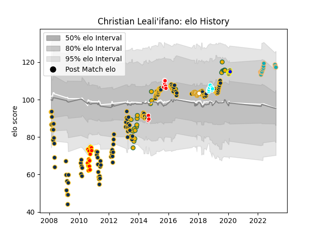

---  
layout: page  
title: Christian Leali'ifano  
date: 2023-03-17 17:31:42.564873  
categories: player  
---
# Christian Leali'ifano

## Positions: FH, C

## Country: Australia

## Current elo: 118.0

## Current Percentile: 91.0

# Elo History

# Match History

| Team                             |   Appearances |   Win Rate |
|:---------------------------------|--------------:|-----------:|
| Brumbies                         |           150 |   0.55     |
| Australia                        |            26 |   0.5      |
| Ulster                           |            17 |   0.676471 |
| Moana Pasifika                   |            14 |   0.142857 |
| Waikato                          |            13 |   0.653846 |
| Canberra Vikings                 |            10 |   0.7      |
| Toyota Industries Shuttles Aichi |             9 |   0.444444 |
| Urayasu D-Rocks                  |             6 |   0.666667 |

| Opponent                          |   Matches |   Win Rate |
|:----------------------------------|----------:|-----------:|
| New South Wales Waratahs          |        18 |   0.444444 |
| Queensland Reds                   |        15 |   0.633333 |
| Western Force                     |        13 |   0.653846 |
| Melbourne Rebels                  |        13 |   0.461538 |
| Chiefs                            |        12 |   0.25     |
| Bulls                             |        11 |   0.636364 |
| Hurricanes                        |        10 |   0.5      |
| Highlanders                       |        10 |   0.5      |
| Sharks                            |         9 |   0.666667 |
| Cheetahs                          |         9 |   0.777778 |
| Stormers                          |         9 |   0.444444 |
| Crusaders                         |         9 |   0.111111 |
| Blues                             |         8 |   0.5      |
| Lions                             |         8 |   0.625    |
| New Zealand                       |         5 |   0.2      |
| Sunwolves                         |         5 |   1        |
| England                           |         4 |   0        |
| Munakata Sanix Blues              |         3 |   0.666667 |
| Argentina                         |         3 |   1        |
| British and Irish Lions           |         3 |   0.333333 |
| La Rochelle                       |         2 |   0.5      |
| Hino Red Dolphins                 |         2 |   1        |
| Melbourne Rising                  |         2 |   1        |
| Auckland                          |         2 |   1        |
| Leinster                          |         2 |   0        |
| Tokyo Sungoliath                  |         2 |   0        |
| Jaguares                          |         2 |   0        |
| Southern Kings                    |         2 |   0.75     |
| Fijian Drua                       |         2 |   0        |
| Wales                             |         2 |   1        |
| Wasps                             |         2 |   0.5      |
| Harlequins                        |         2 |   1        |
| South Africa                      |         2 |   0        |
| Greater Sydney Rams               |         2 |   1        |
| Brisbane City                     |         2 |   0        |
| Benetton Treviso                  |         2 |   1        |
| Sydney Stars                      |         1 |   1        |
| Southland                         |         1 |   0        |
| Black Rams Tokyo                  |         1 |   1        |
| Scotland                          |         1 |   1        |
| Fiji                              |         1 |   1        |
| Taranaki                          |         1 |   0        |
| Tasman                            |         1 |   1        |
| Toyota Verblitz                   |         1 |   0        |
| Urayasu D-Rocks                   |         1 |   0        |
| Uruguay                           |         1 |   1        |
| Wellington                        |         1 |   0        |
| Bay of Plenty                     |         1 |   1        |
| Yokohama Canon Eagles             |         1 |   0        |
| Scarlets                          |         1 |   1        |
| North Harbour Rays                |         1 |   1        |
| Queensland Country                |         1 |   1        |
| Kubota Spears Funabashi Tokyo-Bay |         1 |   0        |
| France                            |         1 |   0        |
| Georgia                           |         1 |   1        |
| Green Rockets Tokatsu             |         1 |   1        |
| Hawke's Bay                       |         1 |   0.5      |
| Dragons                           |         1 |   0.5      |
| Counties Manukau                  |         1 |   1        |
| Ireland                           |         1 |   1        |
| Italy                             |         1 |   1        |
| Connacht                          |         1 |   1        |
| Perth Spirit                      |         1 |   0        |
| Mie Honda Heat                    |         1 |   1        |
| Coca-Cola Red Sparks              |         1 |   1        |
| Munster                           |         1 |   1        |
| Canterbury                        |         1 |   0        |
| Brumbies                          |         1 |   1        |
| North Harbour                     |         1 |   1        |
| Northland                         |         1 |   1        |
| Otago                             |         1 |   1        |
| Zebre                             |         1 |   0        |