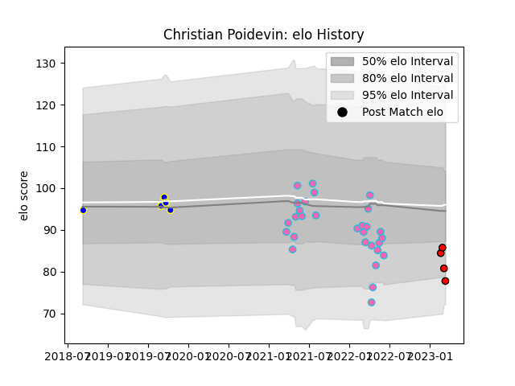

---  
layout: page  
title: Christian Poidevin  
date: 2023-03-02 11:26:35.645925  
categories: player  
---
# Christian Poidevin

## Positions: FL

## Current elo: 86.0

## Current Percentile: 17.0

# Elo History

# Match History

| Team             |   Appearances |   Win Rate |
|:-----------------|--------------:|-----------:|
| L. A. Giltinis   |            29 |   0.689655 |
| Sydney Rays      |             5 |   0.2      |
| San Diego Legion |             2 |   1        |

| Opponent               |   Matches |   Win Rate |
|:-----------------------|----------:|-----------:|
| Utah Warriors          |         5 |   0.6      |
| Houston SaberCats      |         4 |   0.75     |
| Austin Gilgronis       |         3 |   0.666667 |
| New England Free Jacks |         3 |   1        |
| Rugby ATL              |         3 |   0.666667 |
| San Diego Legion       |         3 |   0.666667 |
| Seattle Seawolves      |         3 |   0.666667 |
| Dallas Jackals         |         2 |   1        |
| R.U. New York          |         2 |   0.5      |
| Rugby New York         |         2 |   0.5      |
| Canberra Vikings       |         1 |   0        |
| Fijian Drua            |         1 |   0        |
| NSW Country Eagles     |         1 |   0        |
| Old Glory DC           |         1 |   1        |
| Queensland Country     |         1 |   1        |
| Western Force          |         1 |   0        |