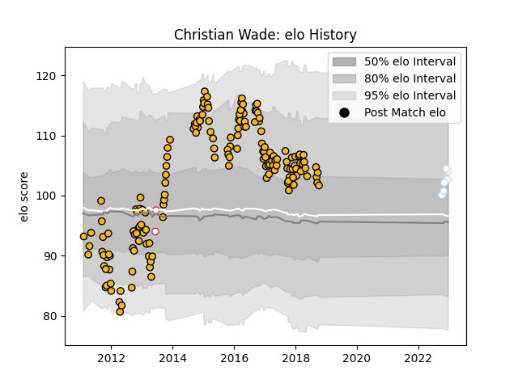

---  
layout: page  
title: Christian Wade  
date: 2023-01-23 15:30:00.918051  
categories: player  
---
# Christian Wade

## Positions: W

## Country: England

## Current elo: 102.0

## Current Percentile: 67.0

# Elo History

# Match History

| Team      |   Appearances |   Win Rate |
|:----------|--------------:|-----------:|
| Wasps     |           165 |   0.542424 |
| Racing 92 |             7 |   0.571429 |
| England   |             2 |   1        |

| Opponent           |   Matches |   Win Rate |
|:-------------------|----------:|-----------:|
| Harlequins         |        20 |   0.35     |
| Exeter Chiefs      |        16 |   0.28125  |
| Leicester Tigers   |        13 |   0.692308 |
| Saracens           |        13 |   0.230769 |
| Gloucester Rugby   |        13 |   0.576923 |
| Bath Rugby         |        12 |   0.666667 |
| Sale Sharks        |        12 |   0.5      |
| London Irish       |        10 |   0.65     |
| Northampton Saints |         9 |   0.555556 |
| Newcastle Falcons  |         9 |   0.722222 |
| Worcester Warriors |         8 |   0.875    |
| Leinster           |         7 |   0.214286 |
| Bayonne            |         5 |   0.7      |
| Ulster             |         2 |   0.5      |
| Stade Toulousain   |         2 |   0.75     |
| London Welsh       |         2 |   1        |
| Argentina          |         2 |   1        |
| La Rochelle        |         2 |   0.5      |
| Dragons            |         2 |   0.5      |
| Connacht           |         2 |   0.5      |
| Bristol Rugby      |         2 |   1        |
| Arix Viadana       |         1 |   1        |
| Mogliano           |         1 |   1        |
| Clermont Auvergne  |         1 |   1        |
| Pau                |         1 |   1        |
| Perpignan          |         1 |   1        |
| Cardiff Blues      |         1 |   0        |
| Brive              |         1 |   1        |
| Toulon             |         1 |   1        |
| Bordeaux Begles    |         1 |   1        |
| Biarritz Olympique |         1 |   0        |
| Zebre              |         1 |   1        |