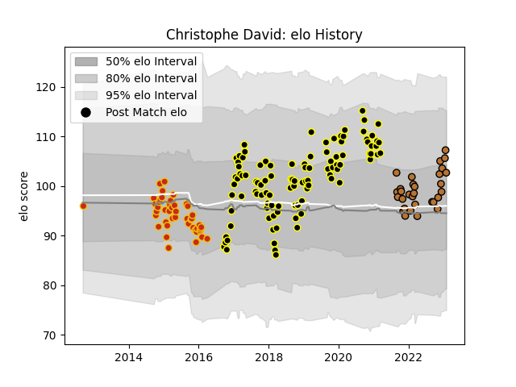

---  
layout: page  
title: Christophe David  
date: 2023-02-02 18:39:33.827341  
categories: player  
---
# Christophe David

## Positions: H, P

## Current elo: 103.0

## Current Percentile: 77.0

# Elo History

# Match History

| Team           |   Appearances |   Win Rate |
|:---------------|--------------:|-----------:|
| Mont-de-Marsan |           103 |   0.509709 |
| Perpignan      |            45 |   0.577778 |
| Narbonne       |            30 |   0.416667 |

| Opponent                   |   Matches |   Win Rate |
|:---------------------------|----------:|-----------:|
| Aurillac                   |        12 |   0.541667 |
| Colomiers                  |        12 |   0.375    |
| Carcassonne                |        11 |   0.545455 |
| Beziers                    |        10 |   0.5      |
| Biarritz Olympique         |        10 |   0.45     |
| Montauban                  |        10 |   0.6      |
| Nevers                     |         9 |   0.222222 |
| Bayonne                    |         8 |   0.4375   |
| Vannes                     |         7 |   0.428571 |
| Provence Rugby             |         7 |   0.428571 |
| Dax                        |         7 |   0.571429 |
| Narbonne                   |         7 |   0.428571 |
| Albi                       |         6 |   0.5      |
| Bourgoin-Jallieu           |         6 |   0.833333 |
| Oyonnax                    |         6 |   0.416667 |
| Rouen                      |         5 |   0.8      |
| Mont-de-Marsan             |         5 |   0.4      |
| Grenoble                   |         5 |   0        |
| Massy                      |         4 |   0.75     |
| Perpignan                  |         4 |   0.75     |
| Soyaux-Angouleme           |         4 |   0.25     |
| Agen                       |         4 |   0.75     |
| Pau                        |         2 |   0.5      |
| Nice                       |         2 |   1        |
| Lyon                       |         2 |   0.5      |
| Suresnes                   |         2 |   1        |
| Tarbes                     |         2 |   1        |
| US Bressane                |         2 |   0.5      |
| Chambery                   |         1 |   0        |
| Carqueiranne-Hyères        |         1 |   1        |
| Blagnac                    |         1 |   0.5      |
| Roval Drome XV             |         1 |   0        |
| Cognac Saint Jean d'Angély |         1 |   1        |
| Valence Romans Drome Rugby |         1 |   1        |
| Rennes                     |         1 |   1        |