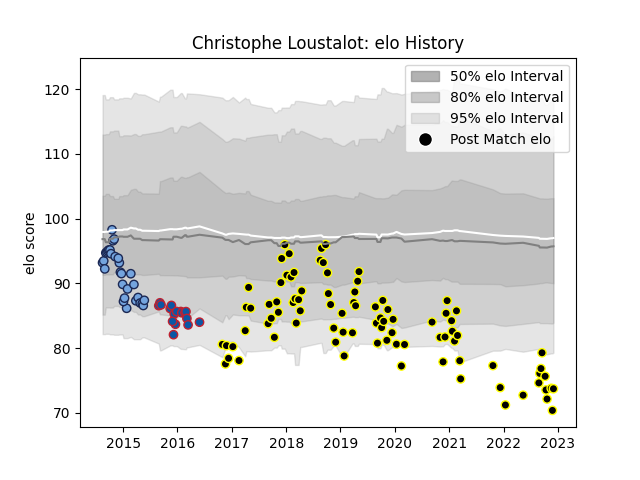

---  
layout: page  
title: Christophe Loustalot  
date: 2023-03-21 17:56:20.559915  
categories: player  
---
# Christophe Loustalot

Last updated: 2023-03-21
## Positions: SH

## Current elo: 62.0

## Current Percentile: 1.0

# Elo History

# Match History

| Team           |   Appearances |   Win Rate |
|:---------------|--------------:|-----------:|
| Mont-de-Marsan |           131 |   0.541985 |
| Bayonne        |            31 |   0.370968 |
| Grenoble       |            17 |   0.411765 |

| Opponent                   |   Matches |   Win Rate |
|:---------------------------|----------:|-----------:|
| Vannes                     |        10 |   0.5      |
| Grenoble                   |        10 |   0.4      |
| Biarritz Olympique         |         9 |   0.5      |
| Oyonnax                    |         9 |   0.5      |
| Carcassonne                |         9 |   0.777778 |
| Soyaux-Angouleme           |         8 |   0.5      |
| Provence Rugby             |         8 |   0.375    |
| Aurillac                   |         8 |   0.625    |
| Beziers                    |         7 |   0.714286 |
| Perpignan                  |         7 |   0.428571 |
| Nevers                     |         7 |   0.285714 |
| Montauban                  |         7 |   0.571429 |
| Rouen                      |         6 |   0.833333 |
| Colomiers                  |         5 |   0.4      |
| Bayonne                    |         5 |   0.5      |
| Stade Francais Paris       |         4 |   0.5      |
| Massy                      |         4 |   0.75     |
| Racing 92                  |         4 |   0        |
| Narbonne                   |         4 |   0.5      |
| Agen                       |         4 |   0.75     |
| Clermont Auvergne          |         4 |   0.25     |
| La Rochelle                |         4 |   0.375    |
| Brive                      |         4 |   0.5      |
| Toulon                     |         3 |   0        |
| Dax                        |         3 |   0.666667 |
| Bordeaux Begles            |         3 |   0.333333 |
| Castres Olympique          |         2 |   0.5      |
| Valence Romans Drome Rugby |         2 |   0.75     |
| Stade Toulousain           |         2 |   0.5      |
| Lyon                       |         2 |   0.5      |
| Connacht                   |         2 |   0        |
| Pau                        |         2 |   0.5      |
| Edinburgh                  |         2 |   0.5      |
| Exeter Chiefs              |         2 |   0.5      |
| Montpellier Herault        |         2 |   0        |
| London Irish               |         1 |   1        |
| Roval Drome XV             |         1 |   0        |
| Bourgoin-Jallieu           |         1 |   1        |
| US Bressane                |         1 |   1        |
| Albi                       |         1 |   1        |