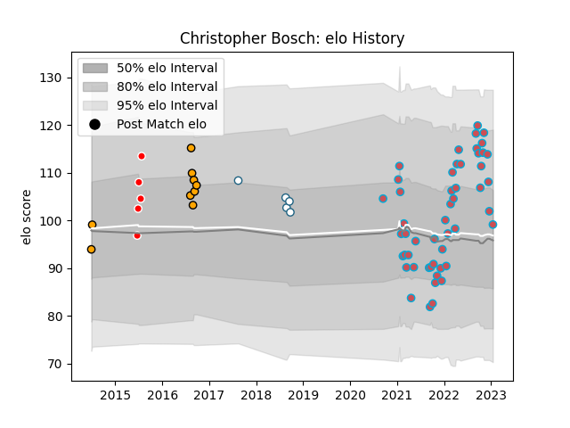

---  
layout: page  
title: Christopher Bosch  
date: 2022-12-09 13:19:00.457603  
categories: player  
---
# Christopher Bosch

## Positions: C

## Current elo: 99.0

## Current Percentile: 55.0

# Elo History

# Match History

| Team             |   Appearances |   Win Rate |
|:-----------------|--------------:|-----------:|
| Bourgoin-Jallieu |            44 |   0.397727 |
| Boland Cavaliers |             7 |   0.285714 |
| Valke            |             5 |   0.6      |
| Griquas          |             2 |   0        |

| Opponent                   |   Matches |   Win Rate |
|:---------------------------|----------:|-----------:|
| Albi                       |         4 |   0.25     |
| Tarbes                     |         4 |   0        |
| Dax                        |         4 |   0.5      |
| Dijon                      |         4 |   0.75     |
| Nice                       |         4 |   0.5      |
| Chambery                   |         3 |   0.666667 |
| Cognac Saint Jean d'Angély |         3 |   0.666667 |
| Massy                      |         3 |   0        |
| Aubenas                    |         3 |   0.333333 |
| Griquas                    |         2 |   0        |
| US Bressane                |         2 |   0        |
| Suresnes                   |         2 |   0.5      |
| Pumas                      |         2 |   0.5      |
| Narbonne                   |         2 |   0.5      |
| Valence Romans Drome Rugby |         2 |   0.25     |
| Golden Lions               |         2 |   0        |
| Blagnac                    |         2 |   0.5      |
| Leopards                   |         1 |   0        |
| Free State Cheetahs        |         1 |   0        |
| Natal Sharks               |         1 |   0        |
| Eastern Province Kings     |         1 |   1        |
| Carqueiranne-Hyères        |         1 |   1        |
| SWD Eagles                 |         1 |   1        |
| Soyaux-Angouleme           |         1 |   0        |
| Border Bulldogs            |         1 |   1        |
| Blue Bulls                 |         1 |   0        |
| Griffons                   |         1 |   1        |