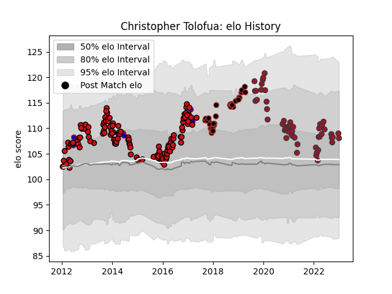

---  
layout: page  
title: Christopher Tolofua  
date: 2022-12-28 12:58:00.684706  
categories: player  
---
# Christopher Tolofua

## Positions: H

## Country: France

## Current elo: 103.0

## Current Percentile: 77.0

# Elo History

# Match History

| Team             |   Appearances |   Win Rate |
|:-----------------|--------------:|-----------:|
| Stade Toulousain |           119 |   0.558824 |
| Toulon           |            51 |   0.598039 |
| Saracens         |            33 |   0.681818 |
| France           |             8 |   0.375    |

| Opponent             |   Matches |   Win Rate |
|:---------------------|----------:|-----------:|
| Clermont Auvergne    |        15 |   0.466667 |
| Brive                |        12 |   0.541667 |
| Stade Francais Paris |        11 |   0.681818 |
| Racing 92            |        10 |   0.6      |
| Bayonne              |         9 |   0.444444 |
| Montpellier Herault  |         9 |   0.333333 |
| Bordeaux Begles      |         9 |   0.5      |
| La Rochelle          |         8 |   0.25     |
| Castres Olympique    |         8 |   0.625    |
| Lyon                 |         8 |   0.5      |
| Perpignan            |         7 |   0.142857 |
| Toulon               |         7 |   0.714286 |
| Pau                  |         7 |   1        |
| Oyonnax              |         6 |   0.75     |
| Grenoble             |         6 |   0.666667 |
| Agen                 |         5 |   1        |
| Connacht             |         5 |   0.6      |
| Biarritz Olympique   |         5 |   1        |
| Stade Toulousain     |         5 |   0.5      |
| Leicester Tigers     |         5 |   0.8      |
| Saracens             |         4 |   0.5      |
| Newcastle Falcons    |         4 |   1        |
| Wasps                |         4 |   0.625    |
| Zebre                |         4 |   1        |
| Gloucester Rugby     |         4 |   0.25     |
| Ospreys              |         3 |   0.5      |
| Harlequins           |         3 |   0.333333 |
| Argentina            |         2 |   0.5      |
| Glasgow Warriors     |         2 |   1        |
| Australia            |         2 |   0        |
| Bath Rugby           |         2 |   0.5      |
| Benetton Treviso     |         2 |   1        |
| Bristol Rugby        |         2 |   0.5      |
| Sale Sharks          |         2 |   0.5      |
| London Irish         |         2 |   1        |
| Northampton Saints   |         2 |   1        |
| Mont-de-Marsan       |         1 |   1        |
| Edinburgh            |         1 |   0        |
| Scotland             |         1 |   1        |
| Ireland              |         1 |   0        |
| New Zealand          |         1 |   0        |
| Munster              |         1 |   0        |
| Ulster               |         1 |   0        |
| Italy                |         1 |   1        |
| Worcester Warriors   |         1 |   1        |
| Exeter Chiefs        |         1 |   0        |