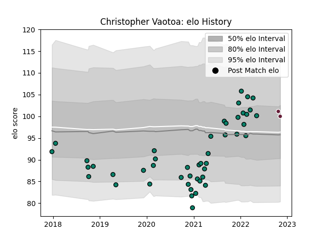

---  
layout: page  
title: Christopher Vaotoa  
date: 2022-11-15 23:43:01.343412  
categories: player  
---
# Christopher Vaotoa

## Positions: P

## Current elo: 100.0

## Current Percentile: 68.0

# Elo History

# Match History

| Team            |   Appearances |   Win Rate |
|:----------------|--------------:|-----------:|
| Montauban       |            46 |   0.478261 |
| Bordeaux Begles |             2 |   0.25     |

| Opponent                   |   Matches |   Win Rate |
|:---------------------------|----------:|-----------:|
| Aurillac                   |         5 |   0.6      |
| Beziers                    |         4 |   0        |
| Carcassonne                |         4 |   0.25     |
| Grenoble                   |         4 |   0.625    |
| Colomiers                  |         3 |   1        |
| US Bressane                |         3 |   0.5      |
| Nevers                     |         3 |   0.333333 |
| Vannes                     |         3 |   0        |
| Narbonne                   |         2 |   1        |
| Oyonnax                    |         2 |   1        |
| Perpignan                  |         2 |   0.5      |
| Provence Rugby             |         2 |   0.5      |
| Rouen                      |         2 |   0.5      |
| Soyaux-Angouleme           |         2 |   0.5      |
| Valence Romans Drome Rugby |         2 |   0.5      |
| Clermont Auvergne          |         1 |   0.5      |
| Mont-de-Marsan             |         1 |   1        |
| Bayonne                    |         1 |   0        |
| Pau                        |         1 |   0        |
| Biarritz Olympique         |         1 |   0        |