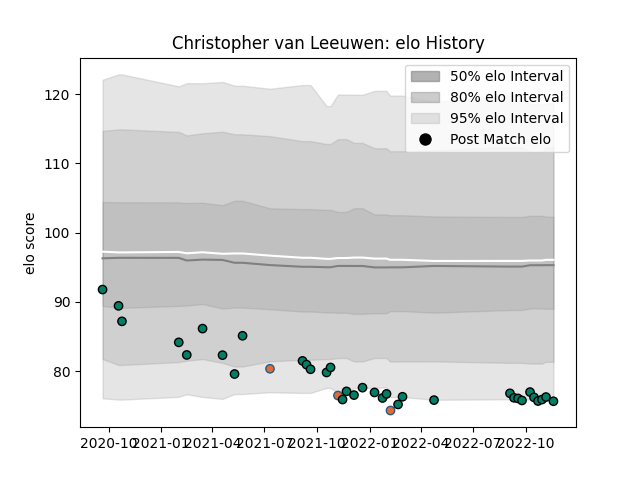

---  
layout: page  
title: Christopher van Leeuwen  
date: 2023-01-17 11:35:45.790262  
categories: player  
---
# Christopher van Leeuwen

## Positions: L

## Country: Netherlands

## Current elo: 74.0

## Current Percentile: 9.0

# Elo History

# Match History

| Team        |   Appearances |   Win Rate |
|:------------|--------------:|-----------:|
| Suresnes    |            45 |   0.466667 |
| Netherlands |             3 |   0        |

| Opponent                   |   Matches |   Win Rate |
|:---------------------------|----------:|-----------:|
| Albi                       |         4 |   0.5      |
| Blagnac                    |         4 |   0.25     |
| Dax                        |         4 |   0.5      |
| Nice                       |         4 |   0.25     |
| Tarbes                     |         3 |   0.666667 |
| Chambery                   |         3 |   0.333333 |
| Cognac Saint Jean d'Angély |         3 |   0.666667 |
| Dijon                      |         3 |   1        |
| Aubenas                    |         3 |   0.333333 |
| Narbonne                   |         3 |   0.333333 |
| Rennes                     |         2 |   1        |
| US Bressane                |         2 |   0        |
| Valence Romans Drome Rugby |         2 |   0        |
| Carqueiranne-Hyères        |         2 |   0.5      |
| Bourgoin-Jallieu           |         2 |   1        |
| Portugal                   |         1 |   0        |
| Russia                     |         1 |   0        |
| Spain                      |         1 |   0        |
| Massy                      |         1 |   0        |