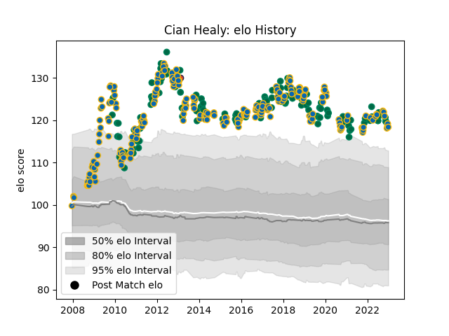

---  
layout: page  
title: Cian Healy  
date: 2023-01-13 11:31:02.676481  
categories: player  
---
# Cian Healy

## Positions: P

## Country: Ireland

## Current elo: 141.0

## Current Percentile: 99.0

# Elo History

# Match History

| Team      |   Appearances |   Win Rate |
|:----------|--------------:|-----------:|
| Leinster  |           232 |   0.775862 |
| Ireland   |           116 |   0.650862 |
| Edinburgh |             1 |   0        |

| Opponent                 |   Matches |   Win Rate |
|:-------------------------|----------:|-----------:|
| Munster                  |        29 |   0.758621 |
| Ulster                   |        21 |   0.809524 |
| Glasgow Warriors         |        18 |   0.694444 |
| Scarlets                 |        15 |   0.733333 |
| England                  |        14 |   0.5      |
| Wales                    |        14 |   0.5      |
| Ospreys                  |        14 |   0.857143 |
| Scotland                 |        13 |   0.846154 |
| Edinburgh                |        13 |   0.846154 |
| Connacht                 |        13 |   0.538462 |
| France                   |        13 |   0.538462 |
| New Zealand              |        13 |   0.307692 |
| Italy                    |        12 |   0.916667 |
| Cardiff Blues            |        12 |   0.958333 |
| Benetton Treviso         |        10 |   0.9      |
| Australia                |         9 |   0.611111 |
| Wasps                    |         7 |   0.714286 |
| Stade Toulousain         |         6 |   0.666667 |
| Zebre                    |         6 |   1        |
| Argentina                |         6 |   0.833333 |
| Castres Olympique        |         6 |   0.75     |
| Bath Rugby               |         6 |   0.833333 |
| Clermont Auvergne        |         6 |   0.5      |
| Northampton Saints       |         5 |   1        |
| Montpellier Herault      |         5 |   0.8      |
| Saracens                 |         5 |   0.6      |
| South Africa             |         5 |   0.6      |
| Dragons                  |         5 |   1        |
| Japan                    |         4 |   0.75     |
| Exeter Chiefs            |         4 |   1        |
| Toulon                   |         4 |   0        |
| Racing 92                |         4 |   1        |
| Leicester Tigers         |         3 |   0.666667 |
| Samoa                    |         3 |   1        |
| Fiji                     |         3 |   1        |
| United States of America |         2 |   1        |
| London Irish             |         2 |   0.25     |
| Lyon                     |         2 |   1        |
| Canada                   |         2 |   1        |
| Bulls                    |         2 |   0.5      |
| Brive                    |         2 |   1        |
| Russia                   |         1 |   1        |
| Romania                  |         1 |   1        |
| New Zealand Maori        |         1 |   0        |
| Sharks                   |         1 |   1        |
| Harlequins               |         1 |   1        |
| Southern Kings           |         1 |   1        |
| Stade Francais Paris     |         1 |   1        |
| Gloucester Rugby         |         1 |   1        |
| Cheetahs                 |         1 |   0        |
| Biarritz Olympique       |         1 |   1        |
| Aironi                   |         1 |   1        |