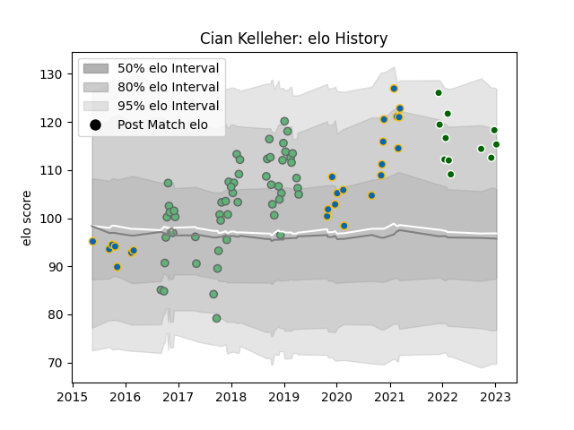

---  
layout: page  
title: Cian Kelleher  
date: 2022-12-12 15:23:23.488528  
categories: player  
---
# Cian Kelleher

## Positions: W

## Current elo: 108.0

## Current Percentile: 85.0

# Elo History

# Match History

| Team                |   Appearances |   Win Rate |
|:--------------------|--------------:|-----------:|
| Connacht            |            53 |   0.537736 |
| Leinster            |            24 |   1        |
| Ealing Trailfinders |             8 |   0.875    |

| Opponent           |   Matches |   Win Rate |
|:-------------------|----------:|-----------:|
| Zebre              |         9 |   0.777778 |
| Glasgow Warriors   |         8 |   0.5      |
| Ulster             |         7 |   0.857143 |
| Cardiff Blues      |         7 |   0.571429 |
| Scarlets           |         6 |   0.5      |
| Ospreys            |         5 |   0.8      |
| Dragons            |         4 |   0.75     |
| Leinster           |         4 |   0        |
| Cheetahs           |         4 |   0.75     |
| Edinburgh          |         3 |   1        |
| Munster            |         3 |   0.333333 |
| Oyonnax            |         2 |   1        |
| Worcester Warriors |         2 |   0.75     |
| Hartpury College   |         2 |   1        |
| Benetton Treviso   |         2 |   1        |
| Brive              |         2 |   1        |
| Perpignan          |         2 |   1        |
| Sale Sharks        |         2 |   0.5      |
| Bordeaux Begles    |         1 |   1        |
| Wasps              |         1 |   0        |
| Stade Toulousain   |         1 |   1        |
| Southern Kings     |         1 |   1        |
| Cornish Pirates    |         1 |   1        |
| Richmond           |         1 |   1        |
| Coventry           |         1 |   1        |
| Nottingham         |         1 |   1        |
| Bedford            |         1 |   0        |
| Connacht           |         1 |   1        |
| Ampthill           |         1 |   1        |