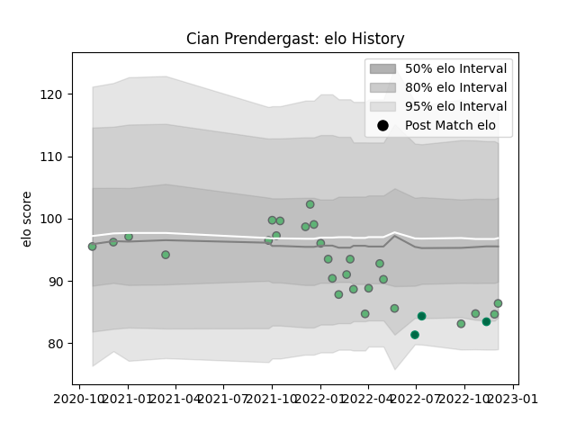

---  
layout: page  
title: Cian Prendergast  
date: 2022-12-12 15:07:13.895771  
categories: player  
---
# Cian Prendergast

## Positions: FL

## Country: Ireland

## Current elo: 86.0

## Current Percentile: 11.0

# Elo History

# Match History

| Team     |   Appearances |   Win Rate |
|:---------|--------------:|-----------:|
| Connacht |            27 |   0.481481 |
| Ireland  |             3 |   0.666667 |

| Opponent             |   Matches |   Win Rate |
|:---------------------|----------:|-----------:|
| Benetton Treviso     |         3 |   1        |
| Edinburgh            |         3 |   0.333333 |
| Leinster             |         3 |   0.333333 |
| Munster              |         3 |   0.333333 |
| Scarlets             |         2 |   1        |
| Stormers             |         2 |   0.5      |
| Stade Francais Paris |         2 |   0.5      |
| Leicester Tigers     |         2 |   0        |
| New Zealand Maori    |         2 |   0.5      |
| Ulster               |         1 |   0        |
| Sharks               |         1 |   0        |
| Lions                |         1 |   1        |
| Bulls                |         1 |   1        |
| Fiji                 |         1 |   1        |
| Dragons              |         1 |   0        |
| Cardiff Blues        |         1 |   0        |
| Zebre                |         1 |   1        |