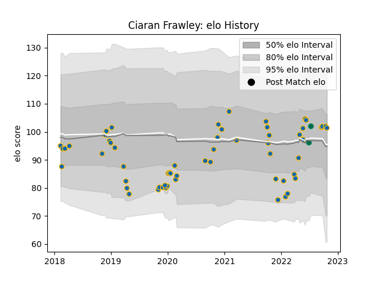

---  
layout: page  
title: Ciaran Frawley  
date: 2023-03-06 11:25:59.198634  
categories: player  
---
# Ciaran Frawley

## Positions: C, FH

## Country: Ireland

## Current elo: 101.0

## Current Percentile: 63.0

# Elo History

# Match History

| Team     |   Appearances |   Win Rate |
|:---------|--------------:|-----------:|
| Leinster |            58 |   0.793103 |
| Ireland  |             2 |   0.5      |

| Opponent            |   Matches |   Win Rate |
|:--------------------|----------:|-----------:|
| Munster             |         6 |   0.833333 |
| Ulster              |         5 |   0.6      |
| Scarlets            |         5 |   0.9      |
| Connacht            |         5 |   1        |
| Glasgow Warriors    |         5 |   0.8      |
| Zebre               |         4 |   1        |
| Dragons             |         4 |   1        |
| Edinburgh           |         4 |   0.5      |
| Ospreys             |         3 |   0.666667 |
| Benetton Treviso    |         3 |   0.833333 |
| New Zealand Maori   |         2 |   0.5      |
| Southern Kings      |         2 |   1        |
| Montpellier Herault |         2 |   1        |
| Cardiff Blues       |         2 |   0.5      |
| Bulls               |         2 |   0.5      |
| Northampton Saints  |         1 |   1        |
| Lyon                |         1 |   1        |
| Cheetahs            |         1 |   1        |
| Sharks              |         1 |   0        |
| Stormers            |         1 |   0        |
| Bath Rugby          |         1 |   1        |