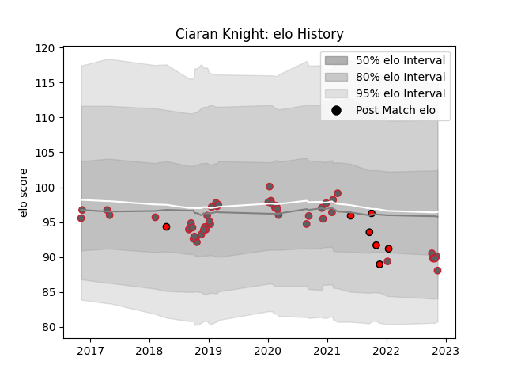

---  
layout: page  
title: Ciaran Knight  
date: 2022-12-09 13:05:59.648116  
categories: player  
---
# Ciaran Knight

## Positions: P

## Current elo: 88.0

## Current Percentile: 27.0

# Elo History

# Match History

| Team             |   Appearances |   Win Rate |
|:-----------------|--------------:|-----------:|
| Gloucester Rugby |            49 |   0.459184 |
| Hartpury College |             7 |   0        |

| Opponent            |   Matches |   Win Rate |
|:--------------------|----------:|-----------:|
| Exeter Chiefs       |         7 |   0.428571 |
| Saracens            |         5 |   0.6      |
| Bath Rugby          |         4 |   0.625    |
| Bristol Rugby       |         4 |   0.5      |
| Wasps               |         4 |   0.75     |
| Northampton Saints  |         4 |   0.5      |
| Newcastle Falcons   |         3 |   0.333333 |
| Sale Sharks         |         3 |   0.333333 |
| London Irish        |         3 |   0.333333 |
| Harlequins          |         3 |   0        |
| Leicester Tigers    |         2 |   0.5      |
| Munster             |         2 |   0        |
| Ealing Trailfinders |         2 |   0        |
| Castres Olympique   |         2 |   0.5      |
| Jersey              |         1 |   0        |
| Bedford             |         1 |   0        |
| Montpellier Herault |         1 |   1        |
| Nottingham          |         1 |   0        |
| Doncaster           |         1 |   0        |
| Coventry            |         1 |   0        |
| Stade Toulousain    |         1 |   0        |
| Worcester Warriors  |         1 |   1        |