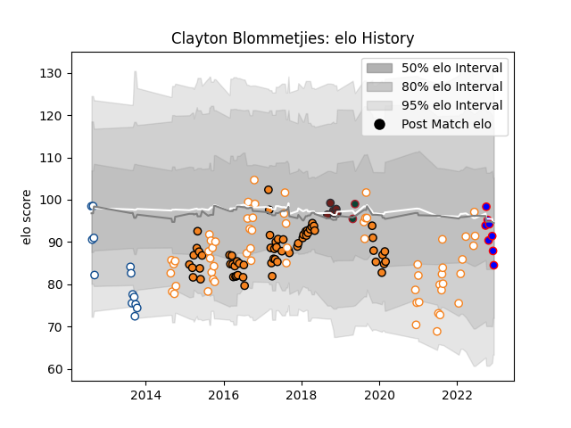

---  
layout: page  
title: Clayton Blommetjies  
date: 2023-01-06 00:16:35.750407  
categories: player  
---
# Clayton Blommetjies

## Positions: FB, W

## Current elo: 110.0

## Current Percentile: 66.0

# Elo History

# Match History

| Team                |   Appearances |   Win Rate |
|:--------------------|--------------:|-----------:|
| Cheetahs            |            63 |   0.333333 |
| Free State Cheetahs |            55 |   0.572727 |
| Blue Bulls          |            13 |   0.346154 |
| Stormers            |            11 |   0.772727 |
| Scarlets            |             6 |   0.5      |
| Leicester Tigers    |             2 |   0        |

| Opponent                 |   Matches |   Win Rate |
|:-------------------------|----------:|-----------:|
| Western Province         |        12 |   0.458333 |
| Griquas                  |        12 |   0.833333 |
| Natal Sharks             |        11 |   0.5      |
| Pumas                    |        10 |   0.65     |
| Southern Kings           |         9 |   1        |
| Golden Lions             |         9 |   0.166667 |
| Blue Bulls               |         8 |   0.5      |
| Stormers                 |         6 |   0.166667 |
| Bulls                    |         6 |   0.5      |
| Lions                    |         6 |   0.333333 |
| Cardiff Blues            |         4 |   0.25     |
| Scarlets                 |         4 |   0.5      |
| Sharks                   |         4 |   0.25     |
| Ulster                   |         4 |   0.25     |
| Sunwolves                |         3 |   1        |
| Edinburgh                |         3 |   0.666667 |
| Ospreys                  |         3 |   0.5      |
| Eastern Province Kings   |         3 |   0.666667 |
| Dragons                  |         3 |   0.666667 |
| Connacht                 |         3 |   0.666667 |
| Free State Cheetahs      |         2 |   0        |
| Highlanders              |         2 |   0        |
| Jaguares                 |         2 |   0        |
| Crusaders                |         2 |   0        |
| Chiefs                   |         2 |   0        |
| Munster                  |         2 |   0        |
| Glasgow Warriors         |         2 |   0        |
| Queensland Reds          |         1 |   0        |
| Western Force            |         1 |   1        |
| Bath Rugby               |         1 |   0        |
| New South Wales Waratahs |         1 |   0        |
| Melbourne Rebels         |         1 |   0        |
| London Irish             |         1 |   1        |
| Leinster                 |         1 |   0        |
| Clermont Auvergne        |         1 |   0        |
| Brumbies                 |         1 |   0        |
| Bristol Rugby            |         1 |   0        |
| Boland Cavaliers         |         1 |   1        |
| Blues                    |         1 |   0        |
| Hurricanes               |         1 |   0        |