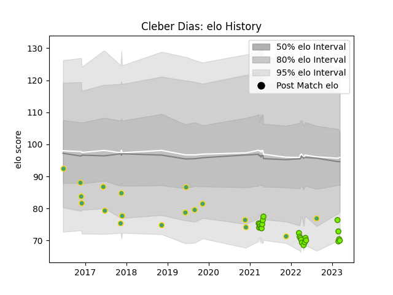

---  
layout: page  
title: Cleber Dias  
date: 2023-03-16 20:02:50.272473  
categories: player  
---
# Cleber Dias

## Positions: FL, L

## Country: Brazil

## Current elo: 70.0

## Current Percentile: 5.0

# Elo History

# Match History

| Team   |   Appearances |   Win Rate |
|:-------|--------------:|-----------:|
| Cobras |            23 |   0.173913 |
| Brazil |            18 |   0.166667 |

| Opponent          |   Matches |   Win Rate |
|:------------------|----------:|-----------:|
| Penarol Rugby     |         5 |   0        |
| Portugal          |         5 |   0.4      |
| Olimpia Lions     |         4 |   0.25     |
| Cafeteros Pro     |         4 |   0.5      |
| Germany           |         3 |   0        |
| Jaguares XV       |         3 |   0        |
| Selknam           |         3 |   0.333333 |
| Romania           |         2 |   0        |
| Dogos XV          |         2 |   0        |
| Kenya             |         2 |   0        |
| Spain             |         2 |   0        |
| Uruguay           |         1 |   0        |
| Belgium           |         1 |   1        |
| Pampas XV         |         1 |   0        |
| New Zealand Maori |         1 |   0        |
| Chile             |         1 |   0        |
| Yacare XV         |         1 |   0        |