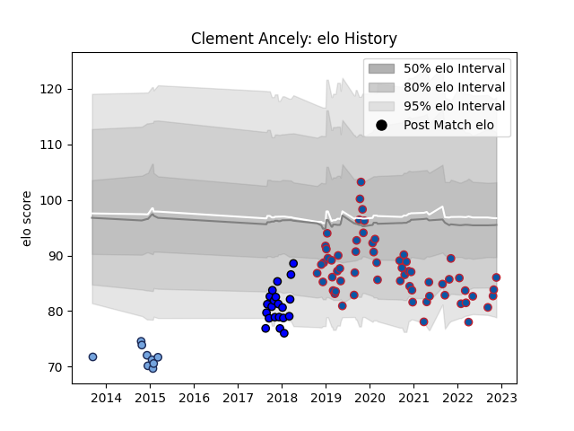

---  
layout: page  
title: Clement Ancely  
date: 2023-01-13 11:32:53.941412  
categories: player  
---
# Clement Ancely

## Positions: FL

## Current elo: 106.0

## Current Percentile: 58.0

# Elo History

# Match History

| Team     |   Appearances |   Win Rate |
|:---------|--------------:|-----------:|
| Grenoble |            77 |   0.448052 |
| Massy    |            26 |   0.461538 |
| Bayonne  |             9 |   0.222222 |

| Opponent                   |   Matches |   Win Rate |
|:---------------------------|----------:|-----------:|
| Colomiers                  |         7 |   0.142857 |
| Vannes                     |         6 |   0.333333 |
| Soyaux-Angouleme           |         6 |   0.666667 |
| Perpignan                  |         6 |   0.333333 |
| Nevers                     |         6 |   0.75     |
| Provence Rugby             |         5 |   0.3      |
| Oyonnax                    |         5 |   0.4      |
| Aurillac                   |         5 |   0.4      |
| Mont-de-Marsan             |         5 |   0.6      |
| Carcassonne                |         5 |   0.8      |
| Beziers                    |         5 |   0.4      |
| Agen                       |         4 |   0.25     |
| Biarritz Olympique         |         4 |   0.375    |
| La Rochelle                |         4 |   0.25     |
| Bayonne                    |         3 |   0.333333 |
| Rouen                      |         3 |   0.666667 |
| Montauban                  |         3 |   0.666667 |
| Clermont Auvergne          |         3 |   0        |
| Racing 92                  |         2 |   0        |
| Valence Romans Drome Rugby |         2 |   1        |
| Narbonne                   |         2 |   0.5      |
| Grenoble                   |         2 |   0.5      |
| Toulon                     |         2 |   0.5      |
| Exeter Chiefs              |         2 |   0.5      |
| Stade Francais Paris       |         2 |   0.5      |
| Harlequins                 |         2 |   0.5      |
| Connacht                   |         2 |   0        |
| Roval Drome XV             |         1 |   1        |
| US Bressane                |         1 |   1        |
| Massy                      |         1 |   1        |
| Dax                        |         1 |   1        |
| Benetton Treviso           |         1 |   0        |
| Pau                        |         1 |   0        |
| Castres Olympique          |         1 |   0        |
| Montpellier Herault        |         1 |   0        |
| Bordeaux Begles            |         1 |   0        |