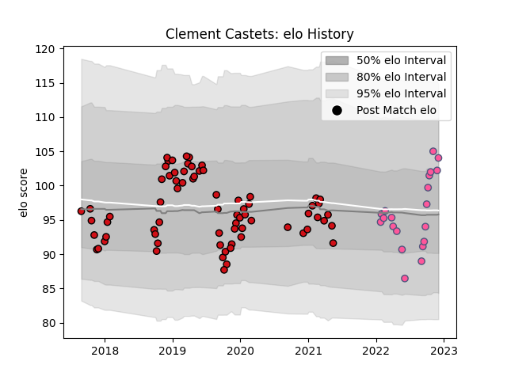

---  
layout: page  
title: Clement Castets  
date: 2023-02-02 19:02:12.716288  
categories: player  
---
# Clement Castets

## Positions: P

## Current elo: 103.0

## Current Percentile: 85.0

# Elo History

# Match History

| Team                 |   Appearances |   Win Rate |
|:---------------------|--------------:|-----------:|
| Stade Toulousain     |            71 |   0.683099 |
| Stade Francais Paris |            25 |   0.58     |

| Opponent             |   Matches |   Win Rate |
|:---------------------|----------:|-----------:|
| Montpellier Herault  |         9 |   0.555556 |
| La Rochelle          |         7 |   0.714286 |
| Bordeaux Begles      |         7 |   0.571429 |
| Pau                  |         7 |   0.857143 |
| Toulon               |         6 |   0.583333 |
| Castres Olympique    |         6 |   0.5      |
| Bayonne              |         5 |   0.6      |
| Racing 92            |         5 |   0.6      |
| Lyon                 |         5 |   0.4      |
| Brive                |         4 |   0.5      |
| Clermont Auvergne    |         4 |   1        |
| Perpignan            |         4 |   0.75     |
| Leinster             |         3 |   0.333333 |
| Stade Francais Paris |         3 |   0.666667 |
| Agen                 |         3 |   1        |
| Bath Rugby           |         2 |   1        |
| Oyonnax              |         2 |   0.75     |
| Gloucester Rugby     |         2 |   1        |
| Connacht             |         2 |   1        |
| Cardiff Blues        |         2 |   0        |
| Stade Toulousain     |         2 |   0.75     |
| Wasps                |         2 |   1        |
| Grenoble             |         1 |   1        |
| Sale Sharks          |         1 |   0.5      |
| Biarritz Olympique   |         1 |   1        |
| Benetton Treviso     |         1 |   0        |