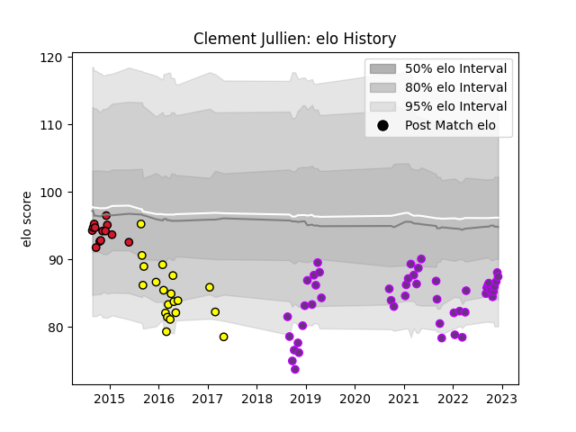

---  
layout: page  
title: Clement Jullien  
date: 2022-12-09 13:10:48.397223  
categories: player  
---
# Clement Jullien

## Positions: H

## Current elo: 87.0

## Current Percentile: 18.0

# Elo History

# Match History

| Team        |   Appearances |   Win Rate |
|:------------|--------------:|-----------:|
| US Bressane |            48 |   0.604167 |
| Carcassonne |            20 |   0.4      |
| Oyonnax     |            13 |   0.538462 |

| Opponent                   |   Matches |   Win Rate |
|:---------------------------|----------:|-----------:|
| Mont-de-Marsan             |         5 |   0.2      |
| Dax                        |         4 |   0.75     |
| Aurillac                   |         4 |   0.25     |
| Bayonne                    |         4 |   0        |
| Montauban                  |         4 |   0.25     |
| Bourgoin-Jallieu           |         3 |   0.666667 |
| Suresnes                   |         3 |   1        |
| Chambery                   |         3 |   1        |
| Brive                      |         3 |   1        |
| Provence Rugby             |         3 |   0.833333 |
| Albi                       |         3 |   0.333333 |
| Blagnac                    |         3 |   1        |
| Nice                       |         2 |   0.5      |
| Oyonnax                    |         2 |   0.5      |
| Perpignan                  |         2 |   0        |
| Massy                      |         2 |   1        |
| Narbonne                   |         2 |   0.5      |
| Lyon                       |         2 |   0        |
| Gloucester Rugby           |         2 |   0        |
| Tarbes                     |         2 |   0.5      |
| Carcassonne                |         2 |   0        |
| Biarritz Olympique         |         2 |   0.5      |
| Colomiers                  |         2 |   0        |
| Stade Francais Paris       |         1 |   1        |
| Soyaux-Angouleme           |         1 |   0        |
| Rennes                     |         1 |   1        |
| Toulon                     |         1 |   0        |
| Rouen                      |         1 |   1        |
| Valence Romans Drome Rugby |         1 |   1        |
| Vannes                     |         1 |   0.5      |
| Agen                       |         1 |   1        |
| Nevers                     |         1 |   1        |
| La Rochelle                |         1 |   1        |
| Grenoble                   |         1 |   1        |
| Cognac Saint Jean d'Angély |         1 |   1        |
| Castres Olympique          |         1 |   0        |
| Bordeaux Begles            |         1 |   1        |
| Beziers                    |         1 |   1        |
| Aubenas                    |         1 |   1        |
| Zebre                      |         1 |   1        |