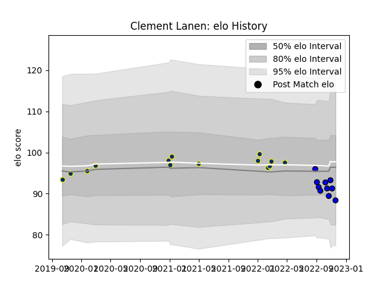

---  
layout: page  
title: Clement Lanen  
date: 2022-11-22 11:37:34.786682  
categories: player  
---
# Clement Lanen

## Positions: FL, N8

## Current elo: 88.0

## Current Percentile: 32.0

# Elo History

# Match History

| Team              |   Appearances |   Win Rate |
|:------------------|--------------:|-----------:|
| Clermont Auvergne |            14 |        0.5 |
| Massy             |            10 |        0.2 |

| Opponent             |   Matches |   Win Rate |
|:---------------------|----------:|-----------:|
| Brive                |         2 |        0.5 |
| Racing 92            |         2 |        0   |
| Agen                 |         1 |        1   |
| Nevers               |         1 |        0   |
| Toulon               |         1 |        0   |
| Stade Toulousain     |         1 |        1   |
| Stade Francais Paris |         1 |        1   |
| Rouen                |         1 |        0   |
| Perpignan            |         1 |        1   |
| Pau                  |         1 |        1   |
| Oyonnax              |         1 |        0   |
| Montauban            |         1 |        0   |
| Aurillac             |         1 |        0   |
| Mont-de-Marsan       |         1 |        1   |
| La Rochelle          |         1 |        0   |
| Harlequins           |         1 |        1   |
| Castres Olympique    |         1 |        0   |
| Carcassonne          |         1 |        1   |
| Bordeaux Begles      |         1 |        0   |
| Biarritz Olympique   |         1 |        0   |
| Beziers              |         1 |        0   |
| Vannes               |         1 |        0   |